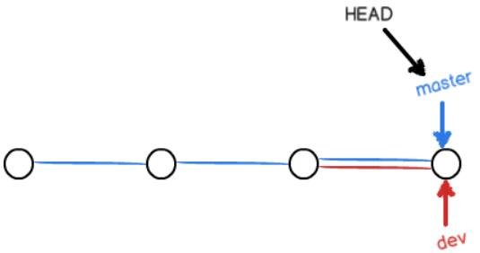

# 一、Git简介

## 1、Git---目前世界上最先进的==分布式====版本控制==系统.

#### 1.1  版本控制


如上图: 同一个人或多人对同一个文件进行修改从而诞生多个版本(即副本),版本控制软件就可以很好的记录修改内容,修改人等信息；方便编辑的人查看改动和检索自己所需要的内容，也有利于多人协作来完成一个项目。

#### 1.2  分布式(与集中式版本控制系统的区别)

##### 	集中式(如CVS、SVN):


版本库集中存放在中央服务器；个人用户使用自己电脑，工作时先从中央处理器取得最新版本，然后工作完后又将自己更新得版本上传至中央服务器(类似于多个人编辑图书馆中得一本书);

弊端: 中央服务器一般都是远程，需要联网，而使用互联网进行文件传输，一旦网速慢就会产生很不好的体验;

##### 	分布式(Git):


没用中央服务器，每个人的电脑上都有一个完整的版本库，工作时不需要联网，即使A,B两人在各自电脑上修改了同一文件，只需将各自的修改推送给对方即可,就可看到互相的修改(不在同一个局域网内，可能会需要类似的中央服务器，只是为了方便“交换”大家的修改，没有也没关系);


# 二、Git常用命令和教程

## 1、Git常用命令

安装完Git后,找到Git->Git Bash进入命令行:

```shell
$ git config --global user.name "Your Name"    --机器名
$ git config --global user.email "email@example.com" --email地址
--global参数表示所有Git仓库都使用该配置
--配置仓库
1.选择一个位置,创建一个空目录例如repository(mkdir repository)
2.进入该目录位置(cd ...)
3.$ git init  --初始化该目录(文件夹)为Git仓库
将文件（例如readme.txt)添加到Git仓库(例如repository)下:
执行命令:
$ git add readme.txt  --可反复使用，添加多个文件
$ git commit -m "message描述" --提交到仓库
修改readme.txt内容后
$ git status                   ---实时查看仓库状态
On branch master
Changes not staged for commit:
  (use "git add <file>..." to update what will be committed)
  (use "git checkout -- <file>..." to discard changes in working directory)

        modified:   readme.txt  --readme.txt被修改过了

Untracked files:
  (use "git add <file>..." to include in what will be committed)

        readme.txt.bak

no changes added to commit (use "git add" and/or "git commit -a") --还没准备提交
--查看修改后的内容与原文件内容的差异
$ git diff
diff --git a/readme.txt b/readme.txt
index d8036c1..013b5bc 100644
--- a/readme.txt
+++ b/readme.txt
@@ -1,2 +1,2 @@
-Git is a version control system. --原来的
+Git is a distributed version control system. --新增distributed单词
 Git is free software.
\ No newline at end of file
$ git add readme.txt
$ git status  --查看仓库的状态
On branch master
Changes to be committed:  --关于readme.txt文件的改动将要提交
  (use "git reset HEAD <file>..." to unstage)

        modified:   readme.txt

Untracked files:
  (use "git add <file>..." to include in what will be committed)

        readme.txt.bak
$ git commit -m "add distributed" --修改后的文件提交到仓库
[master b9866a0] add distributed
 1 file changed, 1 insertion(+), 1 deletion(-)
$ git status
On branch master                        --此时没有需要提交的修改，且仓库目录是干净的
nothing to commit, working tree clean
```

```sh
$ git add readme.txt
$ git commit -m "append GPL"
[master 00983f8] append GPL
 1 file changed, 1 insertion(+), 1 deletion(-)

$ git log  --查看提交历史
commit 00983f88a568903a7939b7413097eef2f91d4068 (HEAD -> master) --版本号
Author: wangyuchen <1341769762@qq.com>
Date:   Fri Apr 12 15:54:14 2019 +0800

    append GPL

commit b9866a054345b4db3a466e30062eb8f7f8e8beb2
Author: wangyuchen <1341769762@qq.com>
Date:   Fri Apr 12 15:39:47 2019 +0800

    add distributed

commit a5fad2cecdae58d675302c19c052584ab26913fb
Author: wangyuchen <1341769762@qq.com>
Date:   Fri Apr 12 15:21:14 2019 +0800

    wrote a readme file

wangyuchen@DESKTOP-47REHO2 MINGW64 /D/Git2.21.0/repository (master)
$ git log --pretty=oneline --一行里显示提交历史
00983f88a568903a7939b7413097eef2f91d4068 (HEAD -> master) append GPL --HEAD->指向当前版本
b9866a054345b4db3a466e30062eb8f7f8e8beb2 add distributed
a5fad2cecdae58d675302c19c052584ab26913fb wrote a readme file

--退回到上个版本,HEAD^^就表示上上版本,以此类推
$ git reset --hard HEAD^
HEAD is now at b9866a0 add distributed

$ git log
commit b9866a054345b4db3a466e30062eb8f7f8e8beb2 (HEAD -> master)
Author: wangyuchen <1341769762@qq.com>
Date:   Fri Apr 12 15:39:47 2019 +0800

    add distributed

commit a5fad2cecdae58d675302c19c052584ab26913fb
Author: wangyuchen <1341769762@qq.com>
Date:   Fri Apr 12 15:21:14 2019 +0800

    wrote a readme file

$ git reset --hard 00983 --切换版本($ git reset --hard commit_id(版本号))
HEAD is now at 00983f8 append GPL

$ cat readme.txt
Git is a distributed version control system.
Git is free software distributed under the GPL.

$ git reflog --查看命令历史,以便查看相应版本对应的commit_id，以便切换
00983f8 (HEAD -> master) HEAD@{0}: reset: moving to 00983
b9866a0 HEAD@{1}: reset: moving to HEAD^
00983f8 (HEAD -> master) HEAD@{2}: commit: append GPL
b9866a0 HEAD@{3}: commit: add distributed
a5fad2c HEAD@{4}: commit (initial): wrote a readme file
```

HEAD指向的版本就是当前版本， git reset --hard commit_id 切换版本;

git log查看提交历史(版本号等),用于切换HEAD指向版本;

git reflog --查看命令历史,以便查看相应版本对应的commit_id，以便切换;

## 2、工作区和暂存区

#### 2.1 工作区(Working Directory)

> 电脑中能看见的目录，比如自定义的Git仓库目录(repository文件夹)

#### 2.2 暂存区

> 工作区中有一个隐藏目录`.git`是Git的版本库(Repository);
>
> Git的版本库里存了很多东西，其中最重要的就是称为stage（或者叫index）的暂存区，还有Git为我们自动创建的第一个分支`master`，以及指向`master`的一个指针叫`HEAD`;


把文件添加到Git版本库:

1.`git add xxx`把文件添加进去，实际上把文件修改添加到`stage`暂存区;

2.`git commit`提交修改，实际上把暂存区的所有内容提交到当前分支;

Git自动为我们创建了唯一一个`master`分支，所以，现在，`git commit`就是往`master`分支上提交更改。

可以简单理解为，需要提交的文件修改通通放到暂存区，然后，一次性提交暂存区的所有修改。

## 3、撤销修改

场景1：当你改乱了工作区某个文件的内容，想直接丢弃工作区的修改时，用命令`git checkout -- file`。

场景2：当你不但改乱了工作区某个文件的内容，还添加到了暂存区时，想丢弃修改，分两步，第一步用命令`git reset HEAD <file>`，就回到了场景1，第二步按场景1操作。

场景3：已经提交了不合适的修改到版本库时，想要撤销本次提交，参考[版本回退](https://www.liaoxuefeng.com/wiki/0013739516305929606dd18361248578c67b8067c8c017b000/0013744142037508cf42e51debf49668810645e02887691000)一节，不过前提是没有推送到远程库。

## 4、删除文件

场景:

一个工作区(Git仓库目录)中的文件(test.txt)->git add(添加到暂存区)->git commit(-m "")(添加到版本库分支)后;

此时要删除文件，首先删除(rm xxx/或手动删除)掉工作区的test.txt，此时git status

```shell
$ git status
On branch master
Changes not staged for commit:
  (use "git add/rm <file>..." to update what will be committed)
  (use "git checkout -- <file>..." to discard changes in working directory)

        deleted:    test.txt

no changes added to commit (use "git add" and/or "git commit -a")
Git知道你从工作区中删除了test.txt;但版本库中还存在test.txt
```

此时若想彻底删除(删除版本库中的)git rm-->git commit(-m "")

```shell
$ git rm test.txt  --git rm xxx
rm 'test.txt'

$ git commit -m "remove test.txt" --git commit
[master 9b8c3f8] remove test.txt
 1 file changed, 1 deletion(-)
 delete mode 100644 test.txt
```

若想恢复工作区中的文件(版本库中还存在test.txt)

`git checkout -- test.txt`即还原;

`git checkout`其实是用版本库里的版本替换工作区的版本，无论工作区是修改还是删除，都可以“一键还原”。

命令`git rm`用于删除一个文件。如果一个文件已经被提交到版本库，那么你永远不用担心误删，但是要小心，你只能恢复文件到最新版本，你会丢失**最近一次提交后你修改的内容**。

## 5、远程仓库

第1步：创建SSH Key。在用户主目录下，看看有没有.ssh目录，如果有，再看看这个目录下有没有`id_rsa`和`id_rsa.pub`这两个文件，如果已经有了，可直接跳到下一步。如果没有，打开Shell（Windows下打开Git Bash），创建SSH Key：

```
$ ssh-keygen -t rsa -C "youremail@example.com"
```

你需要把邮件地址换成你自己的邮件地址，然后一路回车，使用默认值即可，由于这个Key也不是用于军事目的，所以也无需设置密码。

如果一切顺利的话，可以在用户主目录里找到`.ssh`目录，里面有`id_rsa`和`id_rsa.pub`两个文件，这两个就是SSH Key的秘钥对，`id_rsa`是私钥，不能泄露出去，`id_rsa.pub`是公钥，可以放心地告诉任何人。

第2步：登陆GitHub，打开“Account settings”，“SSH Keys”页面：

然后，点“Add SSH Key”，填上任意Title，在Key文本框里粘贴`id_rsa.pub`文件的内容：

点“Add Key”，你就应该看到已经添加的Key：

#### 5.1 添加远程库进行远程同步

实现本地Git仓库与Github上新建一个Git仓库进行远程同步；这样GitHub上的仓库即可以作为备份也可以用来协作。

1.在Github上新建一个Git仓库


自定义Repository name(Git仓库名),点击创建

2.根据提示在Git Bash(Git工具命令行中操作),此时所提交的修改要已经commit到本机版本库中,且在当前master


```shell
$ git remote add origin https://github.com/cauliflowBird/test.git
添加后，远程库的名字就是origin，这是Git默认的叫法，也可以改成别的，但是origin这个名字一看就知道是远程库;

下一步，把本地库的所有内容推送到远程库上：
$ git push -u origin master

把本地库的内容推送到远程，用`git push`命令，实际上是把当前分支`master`推送到远程。

由于远程库是空的，我们第一次推送`master`分支时，加上了`-u`参数，Git不但会把本地的`master`分支内容推送的远程新的`master`分支，还会把本地的master分支和远程的master分支关联起来，在以后的推送或者拉取时就可以简化命令。

现在起，只要本地作了提交，就可以通过命令：
$ git push origin master
把本地master分支的最新修改推送至GitHub，现在就拥有了真正的分布式版本库。
```

注意:当本地master分支与远程Github上master分支关联起来后，若先在Github上master分支手动作了修改，此时要向基于远程(Github分支)同步到本地master后`$ git pull --rebase origin master`

才能推送本地的修改到远程master`$ git push origin master`,否则直接push会报错。

#### 5.2  从远程库克隆

没有本地Git仓库的情况下,先在Github上新建一个Git仓库,然后用命令`git clone`克隆一个本地Git仓库；


从已创建的远程Github仓库获得clone的url(**此时是使用HTTPS协议的url,当然也可以点击Use ssH使用ssh协议的url(最快)**),然后

```shell
wangyuchen@DESKTOP-47REHO2 MINGW64 /D/Git2.21.0/repository (master)
$ git clone https://github.com/cauliflowBird/gitskills.git
Cloning into 'gitskills'...
remote: Enumerating objects: 3, done.
remote: Counting objects: 100% (3/3), done.
remote: Total 3 (delta 0), reused 0 (delta 0), pack-reused 0
Unpacking objects: 100% (3/3), done.

此时本地Git仓库中就多了gitskills目录及其中的README.MD文件(仓库):
$ ls
gitskills/  LICENSE.txt  readme.txt
$ cd gitskills/

$ ls
README.md
```

## 6、分支管理

场景：在公司中，多人协作完成一个项目，首先个人每天开发进度(代码)需要提交，但不完整的提交(代码不全或者库不完整)可能导致其他人无法正常工作，此时又想要记录每天自己的进度:

此时就需要分支来解决，个人创建专属个人的一个分支，别人看不到，在自己的分支上更新修改直到代码开发完毕，不影响其他人，开发完后再合并到原来的分支上就不会对他人造成影响。

#### 6.1  创建与合并分支


每次提交,Git把他们串成一条时间线,这条时间线就是一个分支;目前就一条时间线,在Git里该分支就叫主分支即`master`分支;`HEAD`实际是指向`master`,`master`指向提交,即`HEAD`指向的就是当前分支；

`master`分支是一条线,Git用`master`指向最新的提交(即版本),再用`HEAD`指向`master`就能确定当前分支及当前分支最新的提交点;

每次提交`master`分支就会向前移动一步,不断提交`master`分支的线也会越来越长;


创建一个新的分支`dev`,Git新建一个叫`dev`的指针，指向`master`相同的提交,再将`HEAD`指向`dev`,就表示当前分支在`dev`上；(新建分支很快,增加`dev`指针，改变`HEAD`指向即可)

现在开始，对工作区的修改和提交就是针对`dev`分支了，比如新提交一次后，`dev`指针往前移动一步，而`master`指针不变：


假如我们在`dev`上的工作完成了，就可以把`dev`合并到`master`上;Git合并--直接把`master`指向`dev`的当前提交，就完成了合并。



合并完分支后，甚至可以删除`dev`分支。删除`dev`分支就是把`dev`指针给删掉，删掉后，我们就剩下了一条`master`分支


1.创建`dev`分支，然后切换到`dev`分支

```shell
$ git checkout -b dev   --创建dev分支并切换
Switched to a new branch 'dev'
等同于:
$ git branch dev --创建dev分支
$ git checkout dev --切换到dev分支
Switched to branch 'dev'

$ git branch  --查看所有分支，当前所在分支(*前缀)
* dev
  master
手动修改README.md文件添加一行 Creating a new branch is quick.然后提交:
$ git add README.md
$ git commit -m "branch test"
[dev 193147f] branch test
 1 file changed, 2 insertions(+), 1 deletion(-)
dev分支的工作完成，我们就可以切换回master分支：
$ git checkout master
Switched to branch 'master'
```

切换回`master`分支后，再查看README.md文件，刚才添加的内容不见了！因为那个提交是在`dev`分支上，而`master`分支此刻的提交点并没有变：


把`dev`分支的工作成果合并到`master`分支上

```shell
$ git merge dev  --合并dev分支到master分支上
Updating f071743..193147f
Fast-forward
 README.md | 3 ++-
 1 file changed, 2 insertions(+), 1 deletion(-)
```

`git merge`命令用于合并指定分支到当前分支。合并后，再查看README.md的内容，就可以看到，和`dev`分支的最新提交是完全一样的。

合并完成后，就可以放心地删除`dev`分支了：

```shell
$ git branch -d dev ---删除指定分支
Deleted branch dev (was 193147f).
```

删除后，查看`branch`，就只剩下`master`分支了：

```shell
$ git branch
* master
```

#### 6.2  分支合并冲突

当创建新的分支`feature1`,并选择到`feature1`分支对`readme.txt`修改后-->`git add`-->`git commit -m `"",

之后再切换回原`master`分支,同样对`readme.txt`修改后-->`git add`-->`git commit -m `"";

现在，`master`分支和`feature1`分支各自都分别有新的提交，变成了这样：


然后将`feature1`分支合并到`master`分支会出现冲突:

```shell
wangyuchen@DESKTOP-47REHO2 MINGW64 /D/Git2.21.0/repository (master)
$ git merge feature1  	`合并`
Auto-merging readme.txt
CONFLICT (content): Merge conflict in readme.txt
Automatic merge failed; fix conflicts and then commit the result.

wangyuchen@DESKTOP-47REHO2 MINGW64 /D/Git2.21.0/repository (master|MERGING)
$ git status
On branch master
Your branch is ahead of 'origin/master' by 1 commit.
  (use "git push" to publish your local commits)

You have unmerged paths.
  (fix conflicts and run "git commit")
  (use "git merge --abort" to abort the merge)

Unmerged paths:
  (use "git add <file>..." to mark resolution)

        both modified:   readme.txt
```

查看`readme.txt`

```txt
Git is a distributed version control system.
Git is free software distributed under the GPL.
Git has a mutable index called stage.
Git tracks changes of files.
<<<<<<< HEAD
Creating a new branch is quick & simple.
=======
Creating a new branch is quick AND simple.
>>>>>>> feature1
```

Git用`<<<<<<<`，`=======`，`>>>>>>>`标记出不同分支的内容，我们手动修改如下后保存

```txt
Creating a new branch is quick and simple.
```

再`git add readme.txt`-->`git commit -m "conflict fixed"`,现在，`master`分支和`feature1`分支变成了如下:

 

用带参数的`git log`也可以看到分支的合并情况：

```shell
$ git log --graph --pretty=oneline --abbrev-commit
*   9515212 (HEAD -> master) conflict fixed
|\
| * 463a5ba (feature1) AND simple
* | c9d2941 & simple
|/
* 9b8c3f8 (origin/master) remove test.txt
* cfbc77b add test.txt
* d217e78 insteadmodify
* ba8f3ab git tracks changes
* d621b6c understand how stage works
* 00983f8 append GPL
* b9866a0 add distributed
* a5fad2c wrote a readme file

最后删除分支`feature1`
$ git branch -d feature1
Deleted branch feature1 (was 463a5ba).
```

当Git无法自动合并分支时，就必须首先解决冲突。解决冲突后，再提交，合并完成。

解决冲突就是把Git合并失败的文件手动编辑为我们希望的内容，再提交。

用`git log --graph`命令可以看到分支合并图

#### 6.3  分支管理

通常，合并分支时，如果可能，Git会用`Fast forward`模式，但这种模式下，删除分支后，会丢掉分支信息。

如果要强制禁用`Fast forward`模式，Git就会在merge时生成一个新的commit，这样，从分支历史上就可以看出分支信息

```shell
$ git checkout -b dev `创建一个dev分支并切换到dev分支`
`修改readme.txt后 git add --> git commit -m '''
`再切换到master分支`
$ git checkout master
Switched to branch 'master'
Your branch is ahead of 'origin/master' by 3 commits.
  (use "git push" to publish your local commits)
使用
$ git merge --no-ff -m "merge with no-ff" dev `强制禁用fast forward模式`
Merge made by the 'recursive' strategy.
 readme.txt | 6 ++----
 1 file changed, 2 insertions(+), 4 deletions(-)
合并,此时强制禁用了fast forward模式
`查看分支历史`
git log --graph --pretty=oneline --abbrev-commit
*   3c74617 (HEAD -> master) merge with no-ff
|\
| * b416ba0 (dev) add merge
|/
```

不使用`Fast forward`模式，merge后就像这样：


#### 6.4  Bug分支

当手头上正在dev分支上编写一个文件进行到一半,但被通知要立马去处理master分支bug（新建个bug分支处理)

```shell
$ git status
On branch dev
Changes not staged for commit:
  (use "git add <file>..." to update what will be committed)
  (use "git checkout -- <file>..." to discard changes in working directory)

        modified:   readme.txt
此时使用`git stash`储藏工作现场:
$ git stash
Saved working directory and index state WIP on dev: b416ba0 add merge
`去处理master分支上的bug`(git checkout master-->git checkout -b bug01->修改代码文件->git add->git commit -m ''->回到master分支git checkout master->git merge bug01(合并bug分支到master)->删除bug01分支(git branch -d bug01))bug处理完毕,现在回到dev分支:

$ git stash list `查看之前存储的现场信息`
stash@{0}: WIP on dev: b416ba0 add merge
恢复现场,方法
一是用`git stash apply`恢复，但是恢复后，`stash`内容并不删除，你需要用`git stash drop`来删除；
另一种方式是用`git stash pop`，恢复的同时把stash内容也删了：
$ git stash pop  `恢复现场`
On branch dev
Changes not staged for commit:
  (use "git add <file>..." to update what will be committed)
  (use "git checkout -- <file>..." to discard changes in working directory)

        modified:   readme.txt
再用`git stash list`就看不到任何stash内容了;
```

你可以多次stash，恢复的时候，先用`git stash list`查看，然后恢复指定的stash，用命令：

```shell
$ git stash apply stash@{0}
```

#### 6.5 Feature分支

开发一个新feature，最好新建一个分支；

如果要丢弃一个没有被合并过的分支，可以通过`git branch -D <name>`强行删除。

```shell
$ git checkout -b feature `新建分支并选择`
`对readme.txt作修改后提交`
$ git add readme.txt
$ git commit -m "add feature"
[feature b490f6f] add feature
 1 file changed, 1 insertion(+), 1 deletion(-)
此时返回master分支要进行合并:
$ git checkout master
被通知要撤销该功能，并销毁机密资料
$ git branch -d feature
error: The branch 'feature' is not fully merged.
If you are sure you want to delete it, run 'git branch -D feature'. `强行删除`

$ git branch -D feature
Deleted branch feature (was b490f6f). --删除成功
```

#### 6.6  远程协作

远程仓库克隆时，实际上Git自动把本地的`master`分支和远程的`master`分支对应起来了，并且，远程仓库的默认名称是`origin`。

要查看远程库的信息，用`git remote`：

```shell
$ git remote
origin
```

用`git remote -v`显示更详细的信息：

```shell
$ git remote -v
origin  https://github.com/cauliflowBird/repository.git (fetch) `抓取地址`
origin  https://github.com/cauliflowBird/repository.git (push) `推送地址`
```

##### 推送分支

推送分支，就是把该分支上的所有本地提交推送到远程库。推送时，要指定本地分支，这样，Git就会把该分支推送到远程库对应的远程分支上：

```shell
$ git push origin master
```

如果要推送其他分支，比如`dev`，就改成：

```shell
$ git push origin dev
```

多人协作的工作模式通常是这样：

1. 首先，可以试图用`git push origin <branch-name>`推送自己的修改；
2. 如果推送失败，则因为远程分支比你的本地更新，需要先用`git pull`试图合并；
3. 如果合并有冲突，则解决冲突，并在本地提交；
4. 没有冲突或者解决掉冲突后，再用`git push origin <branch-name>`推送就能成功！

如果`git pull`提示`no tracking information`，则说明本地分支和远程分支的链接关系没有创建，用命令`git branch --set-upstream-to <branch-name> origin/<branch-name>`。

这就是多人协作的工作模式，一旦熟悉了，就非常简单。

总结:

- 查看远程库信息，使用`git remote -v`；
- 本地新建的分支如果不推送到远程，对其他人就是不可见的；
- 从本地推送分支，使用`git push origin branch-name`，如果推送失败，先用`git pull`抓取远程的新提交；
- 在本地创建和远程分支对应的分支，使用`git checkout -b branch-name origin/branch-name`，本地和远程分支的名称最好一致；
- 建立本地分支和远程分支的关联，使用`git branch --set-upstream branch-name origin/branch-name`；
- 从远程抓取分支，使用`git pull`，如果有冲突，要先处理冲突。