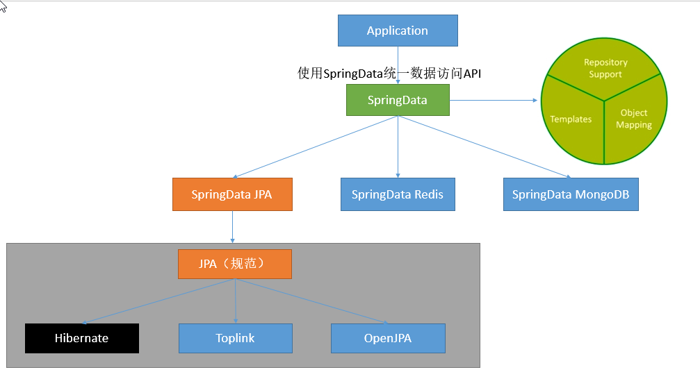

# 一、Spring Boot 入门

## 1、Spring Boot简介

> 简化Spring应用开发的一个框架;
>
> 整个Spring技术栈的一个大整合;
>
> J2EE 开发的一站式解决方案;

## 2、微服务

2014 , martin fowler

微服务: 架构风格(服务微化)

一个应用应该是一组小型服务;可通过HTTP的方式进行互通;


每个功能元素最终都是一个可独立替换和独立升级的软件单元;

详细参照微服务文档:https://martinfowler.com/microservices/

## 3、Spring Boot HelloWorld

### 1、创建一个Maven工程

### 2、导入Spring Boot相关依赖

### 3、编写一个主程序:启动Spring Boot应用

```java
/**
 * @SpringBootApplication来标注一个主程序类 说明这是一个 Spring Boot应用
 */
@SpringBootApplication
public class HelloWorldMainApplication {

    public static void main(String[] args) {
      //Spring应用启动起来
        SpringApplication.run(HelloWorldMainApplication.class,args);
    }
}
```

### 4、编写相关的Controller、Service

```java
@Controller
public class HelloController {

    @ResponseBody
    @RequestMapping("/hello")
    public String hello(){
       return  "Hello World";
    }
}
```

### 5、运行主程序测试

### 6、简化部署

```java
<!--导入这个插件,可以将应用打包成一个可执行的jar包-->
    <build>
        <plugins>
            <plugin>
                <groupId>org.springframework.boot</groupId>
                <artifactId>spring-boot-maven-plugin</artifactId>
            </plugin>
        </plugins>
    </build>
```

 将这个应用打成jar包,直接使用java -jar的命令来执行;

## 4、Hello World探究

### 1、POM文件

#### 1、父项目

```xml
<parent>
        <groupId>org.springframework.boot</groupId>
        <artifactId>spring-boot-starter-parent</artifactId>
        <version>2.1.1.RELEASE</version>
        <relativePath/> <!-- lookup parent from repository -->
</parent>

他(spring-boot-starter-parent)的父项目是
<parent>
        <groupId>org.springframework.boot</groupId>
        <artifactId>spring-boot-dependencies</artifactId>
        <version>2.1.1.RELEASE</version>
        <relativePath>../../spring-boot-dependencies</relativePath>
</parent>
他来真正管理Spring Boot应用里的所有依赖版本
```

Spring Boot的版本控制中心(spring-boot-dependencies);

以后导入各种依赖不需要写(关注)版本;(没有在dependencies里面管理的依赖自然需要声明版本号)

#### 2、导入的依赖(启动器)

```xml
<dependency>
            <groupId>org.springframework.boot</groupId>
            <artifactId>spring-boot-starter-web</artifactId>
 </dependency>
```

**spring-boot-starter**-<font color="#660000">web:</font>

​     spring-boot-starter:spring-boot场景启动器;帮我们导入了web模块正常运行需要的组件;

​     

Spring Boot将所有的功能场景抽取出来,做成一个个starters(启动器),只需在项目中引入这些starter相关场景的所有依赖都会导入进来。要用什么功能就导入什么场景启动器。


### 2、主程序类、主入口类

```java
/**
 * @SpringBootApplication来标注一个主程序类 说明这是一个 Spring Boot应用
 */
@SpringBootApplication
public class HelloWorldMainApplication {

    public static void main(String[] args) {
      //Spring应用启动起来
        SpringApplication.run(HelloWorldMainApplication.class,args);
    }
}
```

**@SpringBootApplication**:标注在某个类上说明这个类是SpringBoot的主配置类,通过运行该类的main方法来启动Spring Boot应用;


```java
@Target({ElementType.TYPE})
@Retention(RetentionPolicy.RUNTIME)
@Documented
@Inherited
@SpringBootConfiguration
@EnableAutoConfiguration
@ComponentScan(
    excludeFilters = {@Filter(
    type = FilterType.CUSTOM,
    classes = {TypeExcludeFilter.class}
), @Filter(
    type = FilterType.CUSTOM,
    classes = {AutoConfigurationExcludeFilter.class}
)}
)
public @interface SpringBootApplication {
```

**@SpringBootConfiguration**:Spring Boot的配置类;

​                标注在某个类上，表示这是一个Spring Boot的配置类;

​                **@Configuration**:配置类上来标注这个注解;  

​                           配置类 -------- 配置文件; 配置类也是容器中的一个组件; @Component


@**EnableAutoConfiguration**:开启自动配置功能;

​                 以前我们需要配置的东西, Spring Boot帮我们自动配置; **@EnableAutoConfiguration**告诉SpringBoot开启自动配置功能;这样自动配置才能生效;

```java
@AutoConfigurationPackage
@Import({AutoConfigurationImportSelector.class})
public @interface EnableAutoConfiguration {
```

**@AutoConfigurationPackage**:自动配置包

​      @**Import**({Registrar.class}); Spring的底层注解@import,给容器中导入一个组件;导入的组件由Registrar.class

​      ==将主配置类(@SpringBootApplication标注的类)的所在包及下面所有子包里面的所有组件扫描到Spring容器中;==  

**@Import**({AutoConfigurationImportSelector.class});

​         给容器中导入组件?

​         **AutoConfigurationImportSelector**: 导入哪些组件的选择器;

​         将所有需要导入的组件以全类名的方式返回;这些组件就会被添加到容器中。

​         会给容器中导入非常多的自动配置类(xxxAutoConfiguration);就是给容器中导入这个场景需要的所有组件,并配置好这些组件;

   

有了自动配置类,免去了手动编写配置注入功能组件的工作;

​       SpringFactoriesLoader.loadFactoryNames(EnableAutoConfiguration.class,classLoader);

​       ==Spring Boot在启动的时候从类路径下的META-INF/spring.factories中获取EnableAutoConfiguration指定的值,将这些值作为自动配置类导入到容器中,自动配置类就生效,帮我们进行自动配置工作;==以前我们需要自己配置的东西，自动配置类都帮我们做了;

J2EE的整体整合解决和自动配置都在spring-boot-autoconfigure-2.1.1.RELEASE.jar中.


## 5、使用Spring Initializer快速创建Spring Boot项目

IDE都支持使用Spring的项目创建向导快速创建一个Spring Boot项目:

选择我们需要的模块;向导会联网创建Spring Boot项目;

默认生成的Spring Boot项目;

- 主程序已经生成好了,我们只需要我们自己的逻辑
- resources文件夹中目录结构
  - static:保存所有的静态资源; js css images;

  - templates:保存所有的模板页面;(Spring Boot默认jar包使用嵌入式的tomcat,默认不支持jsp页面);可以使用模板引擎(freemarker、thymeleaf);

  - application.properties: Spring Boot应用的配置文件;可以修改一些默认设置。

    

# 二、配置文件

## 1、配置文件

SpringBoot使用一个全局的配置文件,配置文件名是固定的:

- application.properties
- application.yml

 配置文件作用:修改SpringBoot自动配置的默认值(SpringBoot在底层都自动配置好的);


yml是YAML语言(YAML Ain't  Markup Language)

​          YAML  A Markup Language:是一个标记语言

​          YAML  isn't Markup  Language:不是一个标记语言;

标记语言:

​          以前的配置文件;大多都使用的是**xxxx.xml**文件;

​          YAML:**以数据为中心**,比json、xml等更适合做配置文件;

​          YAML:配置例子

```yaml
server:
  port:8081
```

​          XML:

```xml
<server>
  <port>8081</port>
</server>
```


## 2、YAML语法 :

### 1、基本语法

k:(空格)v ;表示一对键值对(空格必须有);

以**空格**的缩进来控制层级关系;只要是左对齐的一列数据都是同一个层级的

```yaml
server:
    port: 8081
    path: /hello
```

属性和值也是大小写敏感的;

### 2、值的写法

**字面量: 普通得值(数字,字符串,布尔)**

k:(空格) v: 字面直接来写;

​                 字符串默认不用加上单引号或者双引号;

​                  "" ：双引号:不会转义字符串里得特殊字符,特殊字符会作为本身想表达的意思

​                             name: "zhangsan \n lisi"：输出; zhangsan 换行  lisi

​                  ''：单引号;会转义特殊字符,特殊字符最终只是一个普通的字符串数据

​                                name:  ’zhangsan \n lisi'; 输出 :zhangsan  \n lisi                

**对象、Map (属性和值)  (键值对);**

​     k: v：在下一行写对象的属性和值的关系;注意缩进

​          对象还是k: v的方式

```:antigua_barbuda:
friends:
   lastName: zhangsan
   age: 20
```

行内写法:

```:arrow_backward:
friends: {lastName: zhangsan,age: 18}
```

**数组(List、Set) :**

  用-(空格)值表示数组中的一个元素

 ```:arrow_backward:
pets:
  - cat
  - dog
  - pig
 ```

行内写法

```:arrow_backward:
pets: [cat,dog,pig]
```


## 3、配置文件注入

```:arrow_backward:
person:
    lastName: zhangsan
    age: 18
    boss: false
    birth: 2017/12/12
    maps: {k1: v1,k2: 12}
    lists:
      - lisi
      - zhaoliu
    dog:
      name: 小狗
      age: 2
```

javaBean:

```java
/**
 *  将配置文件application.yml中配置的每一个属性值,映射到这个组件中
 *  @ConfigurationProperties:告诉SpringBoot将本类中所有属性和配置文件中相关配置进行绑定
 *  prefix = "person"表示与配置文件中哪个下面的属性进行一一映射
 *  只有这个组件是容器中的组件,才能使用容器提供的@ConfigurationProperties功能
 */
@ConfigurationProperties(prefix = "person")
@Component
public class Person {

    private String lastName;
    private Integer age;
    private Boolean boss;
    private Date    birth;

    private Map<String,Object> maps;
    private List<Object>  lists;
    private Dog dog;

```

我们可以导入配置文件处理器,以后编写配置就有提示了

```xml
<!--导入配置文件处理器,配置文件进行绑定就会有提示-->
<dependency>
   <groupId>org.springframework.boot</groupId>
   <artifactId>spring-boot-configuration-processor</artifactId>
   <optional>true</optional>
</dependency>
```

### 1、properties配置文件在idea中默认utf-8可能会乱码


勾选以上配置解决。

### 2、@Value获取值和@ConfigurationProperties获取值比较

|                                       | @ConfigurationProperties | @Value     |
| :------------------------------------ | ------------------------ | ---------- |
| 功能                                  | 批量注入配置文件中的属性 | 一个个指定 |
| 松散绑定(松散语法)lastName==last-name | 支持                     | 不支持     |
| SpEL(#{})                             | 不支持                   | 支持       |
| JSR303数据校验                        | 支持                     | 不支持     |
| 复杂类型封装(map等)                   | 支持                     | 不支持     |

配置文件yml还是properties他们都能获取到值;

如果,我们只是需要在某个业务逻辑中获取下配置文件中的某项值,使用@Value;

如果,我们专门编写了一个javaBean来和配置文件进行映射,我们就直接使用@ConfigurationProperties;

### 3、配置文件注入值数据校验

```java
@ConfigurationProperties(prefix = "person")
@Component
/**
 * @Validated可进行数据校验
 */
@Validated
public class Person {

    /**
     *  <bean class="Person">
     *    <property name="lastName" value="字面量/${key}从环境变量,配置文件中获取值/#{spEL}"></property>
     *  </bean>
     */
    //@Value("${person.last-name}
    /**
     * @Email表示lastName必须是邮箱格式
     */
    @Email
    private String lastName;
   // @Value("#{11*2}")
    private Integer age;
    //@Value("true")
    private Boolean boss;
    private Date    birth;

    private Map<String,Object> maps;
    private List<Object>  lists;
```

## 4、@PropertySource&@ImportResource

**@PropertySource**：加载指定的配置文件；

```java
/**
 *  将配置文件application.yml中配置的每一个属性值,映射到这个组件中
 *  @ConfigurationProperties:告诉SpringBoot将本类中所有属性和配置文件中相关配置进行绑定
 *  prefix = "person"表示与配置文件中哪个下面的属性进行一一映射
 *  只有这个组件是容器中的组件,才能使用容器提供的@ConfigurationProperties功能
 *  @ConfigurationProperties(prefix = "person")默认从全局配置文件获取值。
 */
//@ConfigurationProperties(prefix = "person")
@PropertySource(value = {"classpath:person.properties"})
@Component
/**
 * @Validated可进行数据校验
 */
//@Validated
public class Person {

    /**
     *  <bean class="Person">
     *    <property name="lastName" value="字面量/${key}从环境变量,配置文件中获取值/#{spEL}"></property>
     *  </bean>
     */
    //@Value("${person.last-name}
    /**
     * @Email表示lastName必须是邮箱格式
     */
    //@Email
    private String lastName;
   // @Value("#{11*2}")
    private Integer age;
    //@Value("true")
    private Boolean boss;
    private Date    birth;

    //@Value("${person.maps}")
    private Map<String,Object> maps;
    private List<Object>  lists;
    private Dog dog;
```

**@ImportResource**：导入Spring的配置文件,让配置文件里的内容生效;

Springboot里没有Spring的配置文件,我们自己编写的配置文件,也不能自动识别;

想让Spring的配置文件生效,加载进来;**@ImportResource**标注在一个配置类/(主程序类)上

```java
@ImportResource(locations = {"classpath:beans.xml"})
导入Spring的配置文件让其生效
```


不来编写Spring的配置文件

```xml
<?xml version="1.0" encoding="UTF-8"?>
<beans xmlns="http://www.springframework.org/schema/beans"
       xmlns:xsi="http://www.w3.org/2001/XMLSchema-instance"
       xsi:schemaLocation="http://www.springframework.org/schema/beans http://www.springframework.org/schema/beans/spring-beans.xsd">

    <bean id="helloService" class="com.yuchen.springboot.service.HelloService"></bean>
</beans>
```

SpringBoot推荐给容器中添加组件的方式;推荐使用全注解的方式

1、配置类====Spring配置文件

2、使用@Bean给容器中添加组件

```java
/**
 * @Configuration指明当前类是一个配置类,来替代之前的Spring配置文件
 *
 * 在配置文件中用<bean></bean>标签添加组件
 */
@Configuration
public class MyAppConfig {

    //将方法的返回值添加到容器中;容器中该组件的默认id就是方法名
    @Bean
    public HelloService helloService(){
       System.out.println("配置类@Bean给容器中添加组件了");
       return new HelloService();
    }
}
```


## 4、配置文件占位符

### 1、随机数

```java
${random.value}、${random.int}、${random.long}
${random.int(10)}、${random.int[1024,65536]}
```

### 2、占位符获取之前配置的值,如果没有可以使用:指定默认值

```properties
person.last-name=张三${random.uuid}
person.age=${random.int}
person.birth=2017/12/15
person.boss=false
person.maps.k1=v1
person.maps.k2=14
person.lists=a,b,c
person.dog.name=${person.hello:hello}_dog
person.dog.age=15
```

## 5、Profile---Spring对不同环境提供不同的配置功能支持

### 1、多Profile文件

我们在主配置文件编写的时候，文件名可以是application-{profile}.properties/yml

默认使用application.properties的配置;


### 2、yml支持多文档块方式

```yaml
server:
    port: 8081
spring:
    profiles:
        active: prod
---
server:
    port: 8083
spring:
    profiles: dev
---
server:
    port: 8084
spring:
    profiles: prod #指定属于哪个环境
```


### 3、激活指定profile

 	1、在配置文件中指定 spring.profiles.active=dev

​	2、命令行方式:

​                java -jar springboot-config-0.0.1-SNAPSHOT.jar --spring.profiles.active=dev

​                可以直接在测试的时候，配置传入命令行参数

 	3、虚拟机参数；

​		-Dspring.profiles.active=dev

## 6、配置文件加载位置

springboot启动会扫描以下位置的application.properties或者application.yml文件作为Spring boot的默认配置文件

--file:.(即项目根目录--项目名/)/config/

--file:./

--classpath:/config/  (classpath:即类路径相当于WEB-INF/，在springboot中即resources/)

--classpath:/

优先级由高到低，高优先级的配置会覆盖低优先级的配置：

SpringBoot会从这四个位置全部加载主配置文件;并会形成: **互补配置**;(==SpringBoot2.1.1(**更改项目访问路径**)properties文件中server.servlet.context-path=/demo==)


==我们还可以通过spring.config.location来改变默认的配置文件位置;==

java -jar springboot-config02-0.0.1-SNAPSHOT.jar --spring.config.location=E:/application.properties

**项目打包好以后，我们可以使用命令行参数的形式，启动项目的时候来指定配置文件的新位置；指定配置文件和默认加载的这些配置文件共同起作用形成互补配置；**(==SpringBoot2.1.1(**更改项目访问路径**)properties文件中server.servlet.context-path=/demo==)


## 7、外部配置加载顺序

**==SpringBoot也可以从以下位置加载配置；优先级从高到低；高优先级的配置覆盖低优先级的配置，所有的配置会形成互补配置==**

**1.命令行参数**

java -jar springboot-config02-0.0.1-SNAPSHOT.jar --server.port=8087  --server.servlet.context-path=/abc

多个配置间用空格分开；--配置项=值

2.来自java:comp/env的JNDI属性

3.Java系统属性(System.getProperties())

4.操作系统环境变量

5.RandomValuePropertySource配置的random.*属性值 


==由jar包外向jar包内进行寻找:==

==**优先加载带profile**==

**6.jar包外部的application-{profile}.properties或application.yml(带spring.profile)配置文件**

**7.jar包内部的application-{profile}.properties或application.yml(带spring.profile)配置文件**


**==再来加载不带profile==**

**8.jar包外部的application.properties或application.yml(不带spring.profile)配置文件**

**9.jar包内部的application.properties或application.yml(不带spring.profile)配置文件**


10.@Configuration注解类上的@PropertySource

11.通过SpringApplication.setDefaultProperties指定的默认属性

所有支持的配置加载来源；

[参考官方文档](https://docs.spring.io/spring-boot/docs/2.1.1.RELEASE/reference/htmlsingle/#boot-features-external-config)


## 8、自动配置原理

配置文件到底能写什么?怎么写？自动配置原理；

[配置文件能配置的属性参照](https://docs.spring.io/spring-boot/docs/2.1.1.RELEASE/reference/htmlsingle/#configuration-metadata)


### 1、**自动配置原理:**

1)、SpringBoot启动的时候加载主配置类，开启了自动配置功能==@EnableAutoConfiguration==

**2)、@EnableAutoConfiguration 作用:**

- 利用AutoConfigurationImportSelector给容器中导入一些组件?

- 可以查看selectImports()方法的内容；

- List<String> configurations = this.getCandidateConfigurations(annotationMetadata, attributes);获取候选的配置

  - ```java
    SpringFactoriesLoader.loadFactoryNames(this.getSpringFactoriesLoaderFactoryClass(), this.getBeanClassLoader());
    扫面所有jar包类路径下 "META-INF/spring.factories"
    把扫描到的这些文件的内容包装成properties对象
    从properties中获取到EnableAutoConfiguration.class类(类名)对应的值，然后把它们添加在容器中
    ```

    **==将类路径下 "META-INF/spring.factories"里面配置的所有EnableAutoConfiguration的值加入到容器中;==**

    ```properties
    # Auto Configure
    org.springframework.boot.autoconfigure.EnableAutoConfiguration=\
    org.springframework.boot.autoconfigure.admin.SpringApplicationAdminJmxAutoConfiguration,\
    org.springframework.boot.autoconfigure.aop.AopAutoConfiguration,\
    org.springframework.boot.autoconfigure.amqp.RabbitAutoConfiguration,\
    org.springframework.boot.autoconfigure.batch.BatchAutoConfiguration,\
    org.springframework.boot.autoconfigure.cache.CacheAutoConfiguration,\
    org.springframework.boot.autoconfigure.cassandra.CassandraAutoConfiguration,\
    org.springframework.boot.autoconfigure.cloud.CloudServiceConnectorsAutoConfiguration,\
    org.springframework.boot.autoconfigure.context.ConfigurationPropertiesAutoConfiguration,\
    org.springframework.boot.autoconfigure.context.MessageSourceAutoConfiguration,\
    org.springframework.boot.autoconfigure.context.PropertyPlaceholderAutoConfiguration,\
    org.springframework.boot.autoconfigure.couchbase.CouchbaseAutoConfiguration,\
    org.springframework.boot.autoconfigure.dao.PersistenceExceptionTranslationAutoConfiguration,\
    org.springframework.boot.autoconfigure.data.cassandra.CassandraDataAutoConfiguration,\
    org.springframework.boot.autoconfigure.data.cassandra.CassandraReactiveDataAutoConfiguration,\
    org.springframework.boot.autoconfigure.data.cassandra.CassandraReactiveRepositoriesAutoConfiguration,\
    org.springframework.boot.autoconfigure.data.cassandra.CassandraRepositoriesAutoConfiguration,\
    org.springframework.boot.autoconfigure.data.couchbase.CouchbaseDataAutoConfiguration,\
    org.springframework.boot.autoconfigure.data.couchbase.CouchbaseReactiveDataAutoConfiguration,\
    org.springframework.boot.autoconfigure.data.couchbase.CouchbaseReactiveRepositoriesAutoConfiguration,\
    org.springframework.boot.autoconfigure.data.couchbase.CouchbaseRepositoriesAutoConfiguration,\
    org.springframework.boot.autoconfigure.data.elasticsearch.ElasticsearchAutoConfiguration,\
    org.springframework.boot.autoconfigure.data.elasticsearch.ElasticsearchDataAutoConfiguration,\
    org.springframework.boot.autoconfigure.data.elasticsearch.ElasticsearchRepositoriesAutoConfiguration,\
    org.springframework.boot.autoconfigure.data.jdbc.JdbcRepositoriesAutoConfiguration,\
    org.springframework.boot.autoconfigure.data.jpa.JpaRepositoriesAutoConfiguration,\
    org.springframework.boot.autoconfigure.data.ldap.LdapRepositoriesAutoConfiguration,\
    org.springframework.boot.autoconfigure.data.mongo.MongoDataAutoConfiguration,\
    org.springframework.boot.autoconfigure.data.mongo.MongoReactiveDataAutoConfiguration,\
    org.springframework.boot.autoconfigure.data.mongo.MongoReactiveRepositoriesAutoConfiguration,\
    org.springframework.boot.autoconfigure.data.mongo.MongoRepositoriesAutoConfiguration,\
    org.springframework.boot.autoconfigure.data.neo4j.Neo4jDataAutoConfiguration,\
    org.springframework.boot.autoconfigure.data.neo4j.Neo4jRepositoriesAutoConfiguration,\
    org.springframework.boot.autoconfigure.data.solr.SolrRepositoriesAutoConfiguration,\
    org.springframework.boot.autoconfigure.data.redis.RedisAutoConfiguration,\
    org.springframework.boot.autoconfigure.data.redis.RedisReactiveAutoConfiguration,\
    org.springframework.boot.autoconfigure.data.redis.RedisRepositoriesAutoConfiguration,\
    org.springframework.boot.autoconfigure.data.rest.RepositoryRestMvcAutoConfiguration,\
    org.springframework.boot.autoconfigure.data.web.SpringDataWebAutoConfiguration,\
    org.springframework.boot.autoconfigure.elasticsearch.jest.JestAutoConfiguration,\
    org.springframework.boot.autoconfigure.elasticsearch.rest.RestClientAutoConfiguration,\
    org.springframework.boot.autoconfigure.flyway.FlywayAutoConfiguration,\
    org.springframework.boot.autoconfigure.freemarker.FreeMarkerAutoConfiguration,\
    org.springframework.boot.autoconfigure.gson.GsonAutoConfiguration,\
    org.springframework.boot.autoconfigure.h2.H2ConsoleAutoConfiguration,\
    org.springframework.boot.autoconfigure.hateoas.HypermediaAutoConfiguration,\
    org.springframework.boot.autoconfigure.hazelcast.HazelcastAutoConfiguration,\
    org.springframework.boot.autoconfigure.hazelcast.HazelcastJpaDependencyAutoConfiguration,\
    org.springframework.boot.autoconfigure.http.HttpMessageConvertersAutoConfiguration,\
    org.springframework.boot.autoconfigure.http.codec.CodecsAutoConfiguration,\
    org.springframework.boot.autoconfigure.influx.InfluxDbAutoConfiguration,\
    org.springframework.boot.autoconfigure.info.ProjectInfoAutoConfiguration,\
    org.springframework.boot.autoconfigure.integration.IntegrationAutoConfiguration,\
    org.springframework.boot.autoconfigure.jackson.JacksonAutoConfiguration,\
    org.springframework.boot.autoconfigure.jdbc.DataSourceAutoConfiguration,\
    org.springframework.boot.autoconfigure.jdbc.JdbcTemplateAutoConfiguration,\
    org.springframework.boot.autoconfigure.jdbc.JndiDataSourceAutoConfiguration,\
    org.springframework.boot.autoconfigure.jdbc.XADataSourceAutoConfiguration,\
    org.springframework.boot.autoconfigure.jdbc.DataSourceTransactionManagerAutoConfiguration,\
    org.springframework.boot.autoconfigure.jms.JmsAutoConfiguration,\
    org.springframework.boot.autoconfigure.jmx.JmxAutoConfiguration,\
    org.springframework.boot.autoconfigure.jms.JndiConnectionFactoryAutoConfiguration,\
    org.springframework.boot.autoconfigure.jms.activemq.ActiveMQAutoConfiguration,\
    org.springframework.boot.autoconfigure.jms.artemis.ArtemisAutoConfiguration,\
    org.springframework.boot.autoconfigure.groovy.template.GroovyTemplateAutoConfiguration,\
    org.springframework.boot.autoconfigure.jersey.JerseyAutoConfiguration,\
    org.springframework.boot.autoconfigure.jooq.JooqAutoConfiguration,\
    org.springframework.boot.autoconfigure.jsonb.JsonbAutoConfiguration,\
    org.springframework.boot.autoconfigure.kafka.KafkaAutoConfiguration,\
    org.springframework.boot.autoconfigure.ldap.embedded.EmbeddedLdapAutoConfiguration,\
    org.springframework.boot.autoconfigure.ldap.LdapAutoConfiguration,\
    org.springframework.boot.autoconfigure.liquibase.LiquibaseAutoConfiguration,\
    org.springframework.boot.autoconfigure.mail.MailSenderAutoConfiguration,\
    org.springframework.boot.autoconfigure.mail.MailSenderValidatorAutoConfiguration,\
    org.springframework.boot.autoconfigure.mongo.embedded.EmbeddedMongoAutoConfiguration,\
    org.springframework.boot.autoconfigure.mongo.MongoAutoConfiguration,\
    org.springframework.boot.autoconfigure.mongo.MongoReactiveAutoConfiguration,\
    org.springframework.boot.autoconfigure.mustache.MustacheAutoConfiguration,\
    org.springframework.boot.autoconfigure.orm.jpa.HibernateJpaAutoConfiguration,\
    org.springframework.boot.autoconfigure.quartz.QuartzAutoConfiguration,\
    org.springframework.boot.autoconfigure.reactor.core.ReactorCoreAutoConfiguration,\
    org.springframework.boot.autoconfigure.security.servlet.SecurityAutoConfiguration,\
    org.springframework.boot.autoconfigure.security.servlet.SecurityRequestMatcherProviderAutoConfiguration,\
    org.springframework.boot.autoconfigure.security.servlet.UserDetailsServiceAutoConfiguration,\
    org.springframework.boot.autoconfigure.security.servlet.SecurityFilterAutoConfiguration,\
    org.springframework.boot.autoconfigure.security.reactive.ReactiveSecurityAutoConfiguration,\
    org.springframework.boot.autoconfigure.security.reactive.ReactiveUserDetailsServiceAutoConfiguration,\
    org.springframework.boot.autoconfigure.sendgrid.SendGridAutoConfiguration,\
    org.springframework.boot.autoconfigure.session.SessionAutoConfiguration,\
    org.springframework.boot.autoconfigure.security.oauth2.client.servlet.OAuth2ClientAutoConfiguration,\
    org.springframework.boot.autoconfigure.security.oauth2.client.reactive.ReactiveOAuth2ClientAutoConfiguration,\
    org.springframework.boot.autoconfigure.security.oauth2.resource.servlet.OAuth2ResourceServerAutoConfiguration,\
    org.springframework.boot.autoconfigure.security.oauth2.resource.reactive.ReactiveOAuth2ResourceServerAutoConfiguration,\
    org.springframework.boot.autoconfigure.solr.SolrAutoConfiguration,\
    org.springframework.boot.autoconfigure.task.TaskExecutionAutoConfiguration,\
    org.springframework.boot.autoconfigure.task.TaskSchedulingAutoConfiguration,\
    org.springframework.boot.autoconfigure.thymeleaf.ThymeleafAutoConfiguration,\
    org.springframework.boot.autoconfigure.transaction.TransactionAutoConfiguration,\
    org.springframework.boot.autoconfigure.transaction.jta.JtaAutoConfiguration,\
    org.springframework.boot.autoconfigure.validation.ValidationAutoConfiguration,\
    org.springframework.boot.autoconfigure.web.client.RestTemplateAutoConfiguration,\
    org.springframework.boot.autoconfigure.web.embedded.EmbeddedWebServerFactoryCustomizerAutoConfiguration,\
    org.springframework.boot.autoconfigure.web.reactive.HttpHandlerAutoConfiguration,\
    org.springframework.boot.autoconfigure.web.reactive.ReactiveWebServerFactoryAutoConfiguration,\
    org.springframework.boot.autoconfigure.web.reactive.WebFluxAutoConfiguration,\
    org.springframework.boot.autoconfigure.web.reactive.error.ErrorWebFluxAutoConfiguration,\
    org.springframework.boot.autoconfigure.web.reactive.function.client.ClientHttpConnectorAutoConfiguration,\
    org.springframework.boot.autoconfigure.web.reactive.function.client.WebClientAutoConfiguration,\
    org.springframework.boot.autoconfigure.web.servlet.DispatcherServletAutoConfiguration,\
    org.springframework.boot.autoconfigure.web.servlet.ServletWebServerFactoryAutoConfiguration,\
    org.springframework.boot.autoconfigure.web.servlet.error.ErrorMvcAutoConfiguration,\
    org.springframework.boot.autoconfigure.web.servlet.HttpEncodingAutoConfiguration,\
    org.springframework.boot.autoconfigure.web.servlet.MultipartAutoConfiguration,\
    org.springframework.boot.autoconfigure.web.servlet.WebMvcAutoConfiguration,\
    org.springframework.boot.autoconfigure.websocket.reactive.WebSocketReactiveAutoConfiguration,\
    org.springframework.boot.autoconfigure.websocket.servlet.WebSocketServletAutoConfiguration,\
    org.springframework.boot.autoconfigure.websocket.servlet.WebSocketMessagingAutoConfiguration,\
    org.springframework.boot.autoconfigure.webservices.WebServicesAutoConfiguration,\
    org.springframework.boot.autoconfigure.webservices.client.WebServiceTemplateAutoConfiguration
    
    ```

    每一个这样的xxxAutoConfiguration类都是容器中的一个组件，都加入到容器中；用它们来做自动配置；

3)、每一个自动配置类进行自动配置功能；

4)、以**HttpEncodingAutoConfiguration(Http编码自动配置)**为例解释自动配置原理；

```java
@Configuration  //表示这是一个配置类,等同于以前编写的配置文件,也可以给容器添加组件
@EnableConfigurationProperties({HttpProperties.class})//启动指定类的ConfigurationProperties功能；将配置文件中对应的值和HttpProperties绑定起来;并把HttpProperties添加到ioc容器中
@ConditionalOnWebApplication(  
    type = Type.SERVLET
)//Spring底层@Conditional注解,根据不同条件,如果满足指定条件,整个配置类的配置就会生效；判断当前应用是否为web应用,如果是,当前配置类生效;
@ConditionalOnClass({CharacterEncodingFilter.class})//判断当前项目由没有这个类CharacterEncodingFilter;SpringMVC中进行乱码解决的过滤器;
@ConditionalOnProperty(
    prefix = "spring.http.encoding",
    value = {"enabled"},
    matchIfMissing = true
)//判断配置文件中是否存在某个配置 spring.http.encoding.enabled；如果不存在,判断也是成立的
//即使我们配置文件中不配置spring.http.encoding.enabled=true，也是默认生效的；
public class HttpEncodingAutoConfiguration {
    
    //他已经和SpringBoot的配置文件映射了
    private final Encoding properties;
    
    //只有一个有参构造器的情况下，参数的值就会从容器中拿
    public HttpEncodingAutoConfiguration(HttpProperties properties) {
        this.properties = properties.getEncoding();
    }
    
    @Bean  //给容器中添加一个组件,这个组件的某些值需要从properties中获取；
    @ConditionalOnMissingBean
    public CharacterEncodingFilter characterEncodingFilter() {
        CharacterEncodingFilter filter = new OrderedCharacterEncodingFilter();
        filter.setEncoding(this.properties.getCharset().name());
        filter.setForceRequestEncoding(this.properties.shouldForce(org.springframework.boot.autoconfigure.http.HttpProperties.Encoding.Type.REQUEST));
        filter.setForceResponseEncoding(this.properties.shouldForce(org.springframework.boot.autoconfigure.http.HttpProperties.Encoding.Type.RESPONSE));
        return filter;
}
```

根据当前不同的条件判断，决定这个配置类是否生效？

一旦这个配置类生效；这个配置类就会给容器中添加各种组件；这些组件的属性是从对应的xxxProperties中获取的,该Properties类里的每一个属性又是和配置文件绑定的；


5)、所有在配置文件中能配置的属性都是在xxxProperties类中封装着；配置文件能配置什么就可以参照某个功能对应的这个属性类

```java
@ConfigurationProperties(   //从配置文件中获取指定的值和bean属性进行绑定
    prefix = "spring.http"
)
public class HttpProperties {
    private boolean logRequestDetails;
    private final HttpProperties.Encoding encoding = new HttpProperties.Encoding();
```


精髓:

​	**1)、SpringBoot启动会加载大量的自动配置类**

​	**2)、我们先看我们需要的功能有没有SpringBoot默认写好的自动配置类；**

​	**3)、我们再看这个自动配置类中到底配置了哪些组件；(只有我们要用的组件有，我们就不需要再来配置了)**

​	**4)、给容器中自动配置类添加组件的时候，会从properties类中获取某些属性。我们就可以在配置文件中指定这些属性的值；**


xxxAutoConfiguration：自动配置类；

给容器中添加组件

xxxProperties：封装配置文件中相关属性；


### 2、细节

#### 1、@Conditional派生注解(Spring注解版原生的@Conditional作用)

作用:必须是@Conditional指定条件成立，才给容器中添加组件，配置里面的所有内容才生效；

| @Conditional扩展注解            | 作用(判断是否满足当前指定条件)                   |
| ------------------------------- | ------------------------------------------------ |
| @ConditionalOnJava              | 系统的java版本是否符合要求                       |
| @ConditionalOnBean              | 容器中存在指定Bean；                             |
| @ConditionalOnMissingBean       | 容器中不存在指定Bean；                           |
| @ConditionalOnExpression        | 满足SpEL表达式指定                               |
| @ConditionalOnClass             | 系统中有指定的类                                 |
| @ConditionalOnMissingClass      | 系统中没有指定的类                               |
| @ConditionalOnSingleCandidate   | 容器中只有一个指定的Bean，或者这个Bean是首选Bean |
| @ConditionalOnProperty          | 系统中指定的属性是否有指定的值                   |
| @ConditionalOnResource          | 类路径下是否存在指定资源文件                     |
| @ConditionalOnWebApplication    | 当前是Web环境                                    |
| @ConditionalOnNotWebApplication | 当前不是Web环境                                  |
| @ConditionalOnJndi              | JNDI存在指定项                                   |

**自动配置类必须在一定的条件下才能生效；**

我们怎么知道哪些自动配置类生效了?；

我们可以通过启用 debug=true(application.properties文件中)属性；来让控制台打印自动配置报告，这样我们可以很方便的知道哪些自动配置类生效；

```java
============================
CONDITIONS EVALUATION REPORT
============================


Positive matches:(自动配置类启用的)
-----------------

   CodecsAutoConfiguration matched:
      - @ConditionalOnClass found required class 'org.springframework.http.codec.CodecConfigurer' (OnClassCondition)

   CodecsAutoConfiguration.JacksonCodecConfiguration matched:
      - @ConditionalOnClass found required class 'com.fasterxml.jackson.databind.ObjectMapper' (OnClassCondition)

          
 Negative matches:(没有启动，没有匹配成功的自动配置类)
-----------------

   ActiveMQAutoConfiguration:
      Did not match:
         - @ConditionalOnClass did not find required class 'javax.jms.ConnectionFactory' (OnClassCondition)

   AopAutoConfiguration:
      Did not match:
         - @ConditionalOnClass did not find required class 'org.aspectj.lang.annotation.Aspect' (OnClassCondition)

          
          
```


# 三、日志

## 1、日志框架

小张;开发一个大型系统;

​	1、System.out.println("")；将关键数据打印在控制台；去掉?写在一个文件?

​	2、框架来记录系统的一些运行时信息；日志框架；zhanglogging.jar；

​	3、高大上的几个功能？异步模式？自动归档？xxxx？zhanglogging-good.jar；

​	4、将以前框架卸下来？换上新的框架，重新修改之前相关的API；zhanglogging-perfect.jar；

​	5、JDBC---数据库驱动；

​		写了一个统一的接口层；日志门面(日志的一个抽象层)，logging-abstract.jar；

​		给项目中导入具体的日志实现就行了； 我们之前的日志框架都是实现的抽象层；


**市面上的日志框架；**

JUL、JCL、Jboss-logging、logback、log4j、log4j2、slf4j.....

| 日志门面(日志的抽象层)                                       | 日志实现                                     |
| ------------------------------------------------------------ | -------------------------------------------- |
| ~~JCL(Jakarta Commons Logging)~~      SLF4j(Simple Logging Facade for java)  ~~jboss-logging~~ | Log4j JUL(java.util.logging) Log4j2  Logback |

左边选一个门面(抽象层)、右边来选一个实现；

日志门面: SLF4J；

日志实现: Logback；


SpringBoot：底层是Spring框架，Spring框架默认用JCL；

​	==**SpringBoot选用SLF4j和logback；**==

## 2、SLF4j使用

### 1、如何在系统中使用SLF4j(https://www.slf4j.org/manual.html)

以后开发的时候，日志记录方法的调用，不应该直接调用日志的实现类，而是调用日志抽象层里的方法；

给系统里导入slf4j的jar和 logback的实现jar；

```java
import org.slf4j.Logger;
import org.slf4j.LoggerFactory;

public class HelloWorld {
  public static void main(String[] args) {
    Logger logger = LoggerFactory.getLogger(HelloWorld.class);
    logger.info("Hello World");
  }
}
```

图示：


每一个日志的实现框架都有自己的配置文件。使用slf4j以后，**配置文件还是做成日志实现框架自己本身的配置文件；**

### 2、遗留问题

a(slf4j+logback)：Spring(commons-logging)、Hibernate(jboss-logging)、MyBatis、xxx

统一日志记录，即使是别的框架和我一起统一使用slf4j进行输出?


**如何让系统中所有的日志都统一到slf4j：**

==1、将系统中其它 日志框架先排除出去；==

==2、用中间包来替换原有的日志框架；==

==3、我们导入slf4j其它的实现；==


## 3、SpringBoot日志关系

 ```xml
<dependency>
<groupId>org.springframework.boot</groupId>
<artifactId>spring-boot-starter</artifactId>
</dependency>
 ```


SpringBoot使用它来做日志功能；

```xml
<dependency>
      <groupId>org.springframework.boot</groupId>
      <artifactId>spring-boot-starter-logging</artifactId>
      <version>2.1.1.RELEASE</version>
      <scope>compile</scope>
</dependency>
```

底层依赖关系


总结：

​	1)、SpringBoot底层也是使用slf4j+logback的方式进行日志记录

​	2)、SpringBoot也把其它的日志都替换成了slf4j；

​	3)、中间替换包；

​	4)、如果我们要引入其它框架?一定要把这个框架的默认日志依赖移除掉？

​		Spring框架用的是commons-logging；

```xml
<dependency>
	  <groupId>org.springframework</groupId>
      <artifactId>spring-core</artifactId>
      <version>5.1.3.RELEASE</version>
      <scope>compile</scope>
		<exclusions>
			<exclusion>
				<groupId>commons-logging</groupId>
				<artifactId>commons-logging</artifactId>
			</exclusion>
		</exclusions>
	</dependency>
```

==**SpringBoot能自动适配所有的日志，而且底层使用slf4j+logback的方式记录日志，引入其它框架的时候，只需要把这个框架依赖的日志框架排除掉；**==

## 4、日志使用；

### 1、默认配置

SpringBoot默认帮我们配置好了日志；

```java
  //记录器
    Logger logger=LoggerFactory.getLogger(getClass());
    @Test
    public void contextLoads() {
        //System.out.println();
        //日志的级别;
        //由低到高 trace<debug<info<warn<error
        //可以调整需要输出的日志级别；日志就只会在这个级别及以后的高级别生效
        logger.trace("这是trace日志...");
        logger.debug("这是debug日志...");
        //SpringBoot默认给我们使用的是info级别的，没有指定级别的就用SpringBoot默认规定的级别; root级别
        logger.info("这是info日志...");
        logger.warn("这是warn日志...");
        logger.error("这是error日志...");
}
```


```xml
<!--
        日志输出格式：
			%d表示日期时间，
			%thread表示线程名，
			%-5level：级别从左显示5个字符宽度
			%logger{50} 表示logger名字最长50个字符，否则按照句点分割。 
			%msg：日志消息，
			%n是换行符
-->
%d{yyyy-MM-dd} === [%thread] === %-5level === %logger{50} === %msg%n
```

SpringBoot修改日志的默认配置

```properties
logging.level.com.yuchen=trace

#不指定路径在当前项目下生成springboot.log日志
#可以指定完整的路径
#logging.file=E:/springboot.log
#在当前磁盘的根路径(项目所在磁盘根路径)下创建spring文件夹和里面的log文件夹；使用spring.log作为默认文件
logging.path=/spring/log 

#在控制台输出的日志的格式
logging.pattern.console=%d{yyyy-MM-dd} [%thread] %-5level %logger{50} - %msg%n
#指定文件中日志输出的格式
logging.pattern.file=%d{yyyy-MM-dd} === [%thread] === %-5level === %logger{50} === %msg%n
```

| logging.file | logging.path | Example  | Description                      |
| ------------ | ------------ | -------- | -------------------------------- |
| (none)       | (none)       |          | 只在控制台输出                   |
| 指定文件名   | (none)       | my.log   | 输出日志到my.log文件             |
| (none)       | 指定目录     | /var/log | 输出到指定目录的spring.log文件中 |

### 2、指定配置

给类路径下放上每个日志框架自己的配置文件即可；SpringBoot就不使用其默认配置的了

| 记录系统                 | 定制                                                         |
| ------------------------ | ------------------------------------------------------------ |
| 的logback                | `logback-spring.xml`，`logback-spring.groovy`，`logback.xml`，或者`logback.groovy` |
| Log4j2                   | `log4j2-spring.xml` 要么 `log4j2.xml`                        |
| JDK（Java Util Logging） | `logging.properties`                                         |

logback.xml：直接就被日志框架识别了；

**logback-spring.xml**：日志框架就不直接加载日志的配置项，由SpringBoot解析日志配置，可以使用SpringBoot的高级Profile功能

```xml
<springProfile  name = “staging” > 
	<！ - “暂存”配置文件处于活动状态时启用的配置 - > 
    <！ - 可以指定某段配置只在某个环境下生效 - >  
</ springProfile>
```

否则

```java
no application action for [springProfile]
```

```xml
<appender name="stdout" class="ch.qos.logback.core.ConsoleAppender">
        <!--
        日志输出格式：
			%d表示日期时间，
			%thread表示线程名，
			%-5level：级别从左显示5个字符宽度
			%logger{50} 表示logger名字最长50个字符，否则按照句点分割。 
			%msg：日志消息，
			%n是换行符
        -->
        <layout class="ch.qos.logback.classic.PatternLayout">
            <springProfile  name ="dev">
            <pattern>%d{yyyy-MM-dd HH:mm:ss.SSS} ---> [%thread] %-5level %logger{50} - %msg%n</pattern>
            </springProfile>
            <springProfile  name ="!dev">
                <pattern>%d{yyyy-MM-dd HH:mm:ss.SSS} === [%thread] %-5level %logger{50} - %msg%n</pattern>
            </springProfile>
        </layout>
    </appender>
```

## 5、切换日志框架

可以按照slf4j的日志适配图，进行相关的切换；

slf4j+log4j的方式；

```xml
<dependency>
            <artifactId>spring-boot-starter-logging</artifactId>
            <exclusions>
                <exclusion>
                    <artifactId>logback-classic</artifactId>
                    <groupId>ch.qos.logback</groupId>
                </exclusion>
                <exclusion>
                    <artifactId>log4j-to-slf4j</artifactId>
                    <groupId>org.apache.logging.log4j</groupId>
                </exclusion>
            </exclusions>
            <groupId>org.springframework.boot</groupId>
</dependency>

<dependency>
            <groupId>org.slf4j</groupId>
            <artifactId>slf4j-log4j12</artifactId>
</dependency>
```


切换为log4j2

```xml
<dependency>
            <groupId>org.springframework.boot</groupId>
            <artifactId>spring-boot-starter-web</artifactId>
            <exclusions>
                <exclusion>
                    <artifactId>spring-boot-starter-logging</artifactId>
                    <groupId>org.springframework.boot</groupId>
                </exclusion>
            </exclusions>
</dependency>
<dependency>
            <groupId>org.springframework.boot</groupId>
            <artifactId>spring-boot-starter-log4j2</artifactId>
 </dependency>
```


# 四、Web开发

## 1、简介

使用SpringBoot；

​	**1)、创建SpringBoot应用，选中我们需要的模块；**

​	**2)、SpringBoot已经默认将这些场景配置好了，只需要在配置文件种指定少量配置就可以运行起来；**

​	**3)、自己编写业务代码；**

​	

​	自动配置原理?

​	这个场景SpringBoot帮我们配置了什么?能不能修改?能修改哪些配置?能不能扩展?xxx

```java
xxxAutoConfiguration:帮我们给容器种自动配置组件；
xxxProperties：配置类(属性)来封装配置文件的内容；
```

## 2、SpringBoot对静态资源的映射规则；

```java
@ConfigurationProperties(
    prefix = "spring.resources",
    ignoreUnknownFields = false
)
public class ResourceProperties {
//可以设置和静态资源有关的参数，缓存时间等
```


```java
public void addResourceHandlers(ResourceHandlerRegistry registry) {
            if (!this.resourceProperties.isAddMappings()) {
                logger.debug("Default resource handling disabled");
            } else {
                Duration cachePeriod = this.resourceProperties.getCache().getPeriod();
                CacheControl cacheControl = this.resourceProperties.getCache().getCachecontrol().toHttpCacheControl();
                if (!registry.hasMappingForPattern("/webjars/**")) {
                    this.customizeResourceHandlerRegistration(registry.addResourceHandler(new String[]{"/webjars/**"}).addResourceLocations(new String[]{"classpath:/META-INF/resources/webjars/"}).setCachePeriod(this.getSeconds(cachePeriod)).setCacheControl(cacheControl));
                }

                String staticPathPattern = this.mvcProperties.getStaticPathPattern();
                if (!registry.hasMappingForPattern(staticPathPattern)) {
                    this.customizeResourceHandlerRegistration(registry.addResourceHandler(new String[]{staticPathPattern}).addResourceLocations(getResourceLocations(this.resourceProperties.getStaticLocations())).setCachePeriod(this.getSeconds(cachePeriod)).setCacheControl(cacheControl));
                }

            }
}

//配置欢迎页(首页)映射
@Bean
public WelcomePageHandlerMapping welcomePageHandlerMapping(ApplicationContext applicationContext) {
            return new WelcomePageHandlerMapping(new TemplateAvailabilityProviders(applicationContext), applicationContext, this.getWelcomePage(), this.mvcProperties.getStaticPathPattern());
 }

 //配喜欢的图标
        @Configuration
        @ConditionalOnProperty(
            value = {"spring.mvc.favicon.enabled"},
            matchIfMissing = true
        )
        public static class FaviconConfiguration implements ResourceLoaderAware {
            private final ResourceProperties resourceProperties;
            private ResourceLoader resourceLoader;

            public FaviconConfiguration(ResourceProperties resourceProperties) {
                this.resourceProperties = resourceProperties;
            }

            public void setResourceLoader(ResourceLoader resourceLoader) {
                this.resourceLoader = resourceLoader;
            }

            @Bean
            public SimpleUrlHandlerMapping faviconHandlerMapping() {
                SimpleUrlHandlerMapping mapping = new SimpleUrlHandlerMapping();
                mapping.setOrder(-2147483647);
                //所有 **/favicon.ico
                mapping.setUrlMap(Collections.singletonMap("**/favicon.ico", this.faviconRequestHandler()));
                return mapping;
            }

            @Bean
            public ResourceHttpRequestHandler faviconRequestHandler() {
                ResourceHttpRequestHandler requestHandler = new ResourceHttpRequestHandler();
                requestHandler.setLocations(this.resolveFaviconLocations());
                return requestHandler;
            }

            private List<Resource> resolveFaviconLocations() {
                String[] staticLocations = WebMvcAutoConfiguration.WebMvcAutoConfigurationAdapter.getResourceLocations(this.resourceProperties.getStaticLocations());
                List<Resource> locations = new ArrayList(staticLocations.length + 1);
                Stream var10000 = Arrays.stream(staticLocations);
                ResourceLoader var10001 = this.resourceLoader;
                var10001.getClass();
                var10000.map(var10001::getResource).forEach(locations::add);
                locations.add(new ClassPathResource("/"));
                return Collections.unmodifiableList(locations);
            }
        }
```


==1)、所有/webjars/**，都去classpath:/META-INF/resources/webjars/找资源==

​	webjars：以jar包的方式引入静态资源；https://www.webjars.org/


​	localhost:8080/webjars/jquery/3.3.1-1/jquery.js

```xml
<!--引入jQuery-webjar--> 在访问的时候只需要写webjars下面资源的名称即可
        <dependency>
            <groupId>org.webjars</groupId>
            <artifactId>jquery</artifactId>
            <version>3.3.1-1</version>
        </dependency>
```


==2)、"/**"访问当前项目的任何资源,(静态资源的文件夹)==

```
"classpath:/META-INF/resources/", 
"classpath:/resources/", 
"classpath:/static/", 
"classpath:/public/"
"/"当前项目根路径
```

localhost:8080/abc===去静态资源文件夹里面找abc

==3)、欢迎页；静态资源文件夹下的所有index.html页面；被"/**"映射；==

​	localhost:8080/      找到index页面

==4)、所有的**/favicon.ico 都是在静态资源文件下找；==

可在配置文件中自定义静态资源位置

```prope
spring.resources.static-locations=classpath:/hello,classpath:/res
```


## 3、模板引擎

​	JSP、Velocity、Freemarker、Thymeleaf；


​	SpringBoot推荐的Thymeleaf；

​	语法更简单，功能更强大；


### 1、引入thymeleaf；

```xml
<dependency>
            <groupId>org.springframework.boot</groupId>
            <artifactId>spring-boot-starter-thymeleaf</artifactId>
</dependency>
切换thymeleaf版本
<properties>
		<thymeleaf.version>3.0.9.RELEASE</thymeleaf.version>
    	<!-- 布局功能的支持程序 thymeleaf3主程序 layout2以上版本-->
        <!-- thymeleaf2 layout1-->
    	<thymeleaf-layout-dialect.version>2.2.2</thymeleaf-layout-dialect.version>
</properties>
```


### 2、Thymeleaf使用&语法

```java
@ConfigurationProperties(
    prefix = "spring.thymeleaf"
)
public class ThymeleafProperties {
    private static final Charset DEFAULT_ENCODING;
    public static final String DEFAULT_PREFIX = "classpath:/templates/";
    public static final String DEFAULT_SUFFIX = ".html";
    private boolean checkTemplate = true;
    private boolean checkTemplateLocation = true;
    private String prefix = "classpath:/templates/";
    private String suffix = ".html";
```

只要我们把HTML页面放在"classpath:/templates/"，thymeleaf就能自动渲染；

使用：

1、导入thymeleaf的名称空间

 ```xml
<html lang="en" xmlns:th="http://www.thymeleaf.org"></html>
 ```

2、使用thymeleaf语法；

```html
<!DOCTYPE html>
<html lang="en" xmlns:th="http://www.thymeleaf.org">
<head>
    <meta charset="UTF-8">
    <title>Title</title>
</head>
<body>
<h1>成功!</h1>
<!--th:text  将div里面的文本内容设置为 -->
<div th:text="${hello}">这是显示欢迎信息</div>(${hello}后端数据会覆盖前端数据)
</body>
</html>
```

### 3、语法规则

1)、th:text；改变当前元素里的文本内容；

​	th：任意html属性；来替换原生属性的值

​	


2)、表达式？

```properties
Simple expressions:(表达式语法)
    Variable Expressions: ${...}：获取变量值；OGNL；
    		1)、获取对象的属性、调用方法
    		2)、使用内置的基本对象；
    		#ctx : the context object.
            #vars: the context variables.
			#locale : the context locale.
			#request : (only in Web Contexts) the HttpServletRequest object.
			#response : (only in Web Contexts) the HttpServletResponse object.
			#session : (only in Web Contexts) the HttpSession object.
			#servletContext : (only in Web Contexts) the ServletContext object.
			
			${#session.getAttribute('foo')}
            ${#session.id}
			3)、内置的一些工具对象：
			#execInfo : information about the template being processed.
			#messages : methods for obtaining externalized messages inside variables 			 expressions, in the same way as they
			would be obtained using #{…} syntax.
			#uris : methods for escaping parts of URLs/URIs
			Page 20 of 106#conversions : methods for executing the configured 					conversion service (if any).
			#dates : methods for java.util.Date objects: formatting, component 					extraction, etc.
			#calendars : analogous to #dates , but for java.util.Calendar objects.
			#numbers : methods for formatting numeric objects.
			#strings : methods for String objects: contains, startsWith, 						prepending/appending, etc.
			#objects : methods for objects in general.
			#bools : methods for boolean evaluation.
            #arrays : methods for arrays.
            #lists : methods for lists.
            #sets : methods for sets.
            #maps : methods for maps.
            #aggregates : methods for creating aggregates on arrays or collections.
            #ids : methods for dealing with id attributes that might be repeated (for 			  example, as a result of an iteration).
Selection Variable Expressions: *{...}：选择表达式；和${}在功能上是一样的；
	补充：配合  th:object="${session.user}"使用
	<div th:object="${session.user}">
    <p>Name: <span th:text="*{firstName}">Sebastian</span>.</p>
    <p>Surname: <span th:text="*{lastName}">Pepper</span>.</p>
    <p>Nationality: <span th:text="*{nationality}">Saturn</span>.</p>
    </div>
Message Expressions: #{...}：获取国际化内容
Link URL Expressions: @{...}：定义URL;
		@{/order/process(execId=${execId},execType='FAST')}
Fragment Expressions: ~{...}：片段引用表达式
		<div th:insert="~{commons :: main}">...</div>
Literals(字面量)
    Text literals: 'one text' , 'Another one!' ,…
    Number literals: 0 , 34 , 3.0 , 12.3 ,…
    Boolean literals: true , false
    Null literal: null
    Literal tokens: one , sometext , main ,…
Text operations:(文本操作)
    String concatenation: +
    Literal substitutions: |The name is ${name}|
Arithmetic operations:(数学运算)
    Binary operators: + , - , * , / , %
    Minus sign (unary operator): -
Boolean operations:(布尔运算)
    Binary operators: and , or
    Boolean negation (unary operator): ! , not
Comparisons and equality:(比较运算)
    Comparators: > , < , >= , <= ( gt , lt , ge , le )
    Equality operators: == , != ( eq , ne )
Conditional operators:(条件运算(三元运算符))
    If-then: (if) ? (then)
    If-then-else: (if) ? (then) : (else)
    Default: (value) ?: (defaultvalue)
Special tokens:(特殊操作)
Page 17 of 106No-Operation: _
```

## 4、SpringMVC自动配置

https://docs.spring.io/spring-boot/docs/2.1.1.RELEASE/reference/htmlsingle/#boot-features-developing-web-applications

### 1 、Spring MVC Auto-configuration

Spring Boot自动配置好了SpringMVC.

以下是SpringBoot对SpringMVC的默认配置:

- Inclusion of `ContentNegotiatingViewResolver` and `BeanNameViewResolver` beans.

  - 自动配置了ViewResolver(视图解析器：根据方法的返回值得到视图对象(View)，视图对象决定如何渲染(转发？重定向?))
  - ContentNegotiatingViewResolver：组合所有的视图解析器的；
  - ==如何定制：我们可以自己给容器中添加一个视图解析器；自动将其组合进来；==

- Support for serving static resources, including support for WebJars (covered [later in this document](https://docs.spring.io/spring-boot/docs/2.1.1.RELEASE/reference/htmlsingle/#boot-features-spring-mvc-static-content))).静态资源文件夹路径,Webjars

- Static `index.html` support.静态首页访问

- Custom `Favicon` support (covered [later in this document](https://docs.spring.io/spring-boot/docs/2.1.1.RELEASE/reference/htmlsingle/#boot-features-spring-mvc-favicon)).favicon.ico

- 自动注册了of `Converter`, `GenericConverter`, and `Formatter` beans.

  - Converter：转换器；public String hello(User user)：类型转换使用

  - Formatter：格式化器；2017.12.17==Date

    ```java
    @Bean
    public FormattingConversionService mvcConversionService() {
    	WebConversionService conversionService = new 			          WebConversionService(this.mvcProperties.getDateFormat());//日期格式化组件
                this.addFormatters(conversionService);
                return conversionService;
    }
    
    @ConfigurationProperties(
        prefix = "spring.mvc"
    )
    public class WebMvcProperties {
        private Format messageCodesResolverFormat;
        private Locale locale;
        private WebMvcProperties.LocaleResolver localeResolver;
        private String dateFormat;
    ```

    ==自己添加的格式化器转换器，我们只需要放在容器中即可==

- Support for `HttpMessageConverters` (covered [later in this document](https://docs.spring.io/spring-boot/docs/2.1.1.RELEASE/reference/htmlsingle/#boot-features-spring-mvc-message-converters)).

  - HttpMessageConverter：SpringMVC用来转换Http请求和响应的;User--json；

  - `HttpMessageConverters`是从容器中确定的；获取所有的HttpMessageConverter；==自己给容器中添加HttpMessageConverter，只需要将自己的组件注册在容器中(@Bean,@Component)==

- Automatic registration of `MessageCodesResolver` (covered [later in this document](https://docs.spring.io/spring-boot/docs/2.1.1.RELEASE/reference/htmlsingle/#boot-features-spring-message-codes)).定义错误代码生成规则

- Automatic use of a `ConfigurableWebBindingInitializer` bean (covered [later in this document](https://docs.spring.io/spring-boot/docs/2.1.1.RELEASE/reference/htmlsingle/#boot-features-spring-mvc-web-binding-initializer)).

  ==我们可以配置一个ConfigurableWebBindingInitializer来替换默认的；(添加到容器)==

  ```java
  初始化WebDataBinder；
  请求数据====JavaBean；
  ```

  **org.springframework.boot.autoconfigure.web：web的所有自动场景；**

If you want to keep Spring Boot MVC features and you want to add additional [MVC configuration](https://docs.spring.io/spring/docs/5.1.3.RELEASE/spring-framework-reference/web.html#mvc) (interceptors, formatters, view controllers, and other features), you can add your own `@Configuration` class of type `WebMvcConfigurer` but **without** `@EnableWebMvc`. If you wish to provide custom instances of `RequestMappingHandlerMapping`, `RequestMappingHandlerAdapter`, or `ExceptionHandlerExceptionResolver`, you can declare a `WebMvcRegistrationsAdapter` instance to provide such components.

If you want to take complete control of Spring MVC, you can add your own `@Configuration` annotated with `@EnableWebMvc`.

### 2、扩展SpringMVC

```xml
<mvc:view-controller path="/hello"  view-name="success"/>
    <mvc:interceptors>
        <mvc:interceptor>
            <mvc:mapping path="/hello"/>
            <bean></bean>
        </mvc:interceptor>
</mvc:interceptors>
```

==可自己编写一个配置类（@Configuration)，是WebMvcConfigurer类型，不能标注@EnableWebMvc；==

既保留了所有的自动配置，也能用我们扩展的配置；

```java
//使用WebMvcConfigurer可以来扩展SpringMVC的功能
@Configuration
public class MyMvcConfig implements WebMvcConfigurer {

    @Override
    public void addViewControllers(ViewControllerRegistry registry) {
        //浏览器发送 /yuchen 请求来到 success页面
        registry.addViewController("/yuchen").setViewName("success");
    }
}
```

原理：

​	1)、WebMvcAutoConfiguration是SpringMVC的自动配置类

​	2)、在做其它自动配置时会导入；@Import({WebMvcAutoConfiguration.**EnableWebMvcConfiguration**.class}) 

```java
@Configuration
public static class EnableWebMvcConfiguration extends DelegatingWebMvcConfiguration {
    

 private final WebMvcConfigurerComposite configurers = new WebMvcConfigurerComposite();

    public DelegatingWebMvcConfiguration() {
    }
	//从容器中获取所有的WebMvcConfigurer
    @Autowired(
        required = false
    )
    public void setConfigurers(List<WebMvcConfigurer> configurers) {
        if (!CollectionUtils.isEmpty(configurers)) {
            this.configurers.addWebMvcConfigurers(configurers);
            //一个参考实现；将所有的WebMvcConfigurer相关配置都来一起调用；
            
            //public void addViewControllers(ViewControllerRegistry registry) {
        	//	Iterator var2 = this.delegates.iterator();

        	//	while(var2.hasNext()) {
            //		WebMvcConfigurer delegate = (WebMvcConfigurer)var2.next();
            //		delegate.addViewControllers(registry);
        	//	}
			//}
        }
}
```

​	3)、容器中所有的WebMvcConfigurer都会一起起作用;

​	4)、我们的配置类也会被调用；

​	效果：SpringMVC的自动配置和我们的扩展配置都会起作用；

### 3、全面接管SpringMVC

SpringBoot对SpringMVC的自动配置不需要了，所有都是我们自己配；所有的SpringMVC的自动配置都失效了；

**在@Configuration修饰的配置类上加上@EnableWebMvc即可；**

```java
@EnableWebMvc
//使用WebMvcConfigurer可以来扩展SpringMVC的功能
@Configuration
public class MyMvcConfig implements WebMvcConfigurer {

    @Override
    public void addViewControllers(ViewControllerRegistry registry) {
        //浏览器发送 /yuchen 请求来到 success页面
        registry.addViewController("/yuchen").setViewName("success");
    }
}
```

原理:

​	为什么@EnableWebMvc自动配置就失效了；

​	1)、EnableWebMvc的核心

```java
@Import({DelegatingWebMvcConfiguration.class})
public @interface EnableWebMvc {
```

​	2)、

```java
@Configuration
public class DelegatingWebMvcConfiguration extends WebMvcConfigurationSupport {
```

​	3)、

```java
@Configuration
@ConditionalOnWebApplication(
    type = Type.SERVLET
)
@ConditionalOnClass({Servlet.class, DispatcherServlet.class, WebMvcConfigurer.class})
//容器中没有这个组件的时候，这个自动配置类才生效
@ConditionalOnMissingBean({WebMvcConfigurationSupport.class})
@AutoConfigureOrder(-2147483638)
@AutoConfigureAfter({DispatcherServletAutoConfiguration.class, TaskExecutionAutoConfiguration.class, ValidationAutoConfiguration.class})
public class WebMvcAutoConfiguration {
```

​	4)、@EnableWebMvc将WebMvcConfigurationSupport组件导入进来；

​	5)、导入的WebMvcConfigurationSupport只是SpringMVC最基本的功能；

## 5、如何修改SpringBoot的默认配置

模式：

​	1)、SpringBoot在自动配置很多组件的时候，先看容器中有没有用户自己配置的(@Bean,@Component)如果有就用用户自己配置的，如果没有，才自动配置；如果有些组件可以有多个（ViewResolver)将用户配置的和自己默认的组合起来；

​	2)、在SpringBoot中会有非常多的xxxConfigurer帮助我们进行扩展配置

## 6、RestfulCRUD

### 1)、默认访问首页

```java
@Bean//将该组件注册在容器中
public WebMvcConfigurer webMvcConfigurer(){
        WebMvcConfigurer webMvcConfigurer=new WebMvcConfigurer() {
            @Override
            public void addViewControllers(ViewControllerRegistry registry) {
                registry.addViewController("/").setViewName("login");
                registry.addViewController("/index.html").setViewName("login");
            }
        };
        return webMvcConfigurer;
}
```

### 2)、国际化

**1)、编写国际化配置文件；**

2)、使用ResourceBundleMessageSource管理国际化资源文件

3)、在页面使用fmt:message取出国际化内容


SpringBoot中使用步骤：

​	1)、编写国际化配置文件，抽取页面需要显示的国际化消息


​	2)、SpringBoot自动配置好了管理国际化资源文件的组件

```java
@EnableConfigurationProperties
public class MessageSourceAutoConfiguration {
    
private String basename = "messages";
//我们的配置文件可以直接放在类路径下叫messages.properties；
 @Bean
    @ConfigurationProperties(
        prefix = "spring.messages"
    )
    public MessageSourceProperties messageSourceProperties() {
        return new MessageSourceProperties();
    }

    @Bean
    public MessageSource messageSource(MessageSourceProperties properties) {
        ResourceBundleMessageSource messageSource = new ResourceBundleMessageSource();
        if (StringUtils.hasText(properties.getBasename())) {            messageSource.setBasenames(StringUtils.commaDelimitedListToStringArray(
            //设置国际化资源文件的基础名(去掉语言国家代码的)
            StringUtils.trimAllWhitespace(properties.getBasename())));
        }

        if (properties.getEncoding() != null) {
            messageSource.setDefaultEncoding(properties.getEncoding().name());
        }

        messageSource.setFallbackToSystemLocale(properties.isFallbackToSystemLocale());
        Duration cacheDuration = properties.getCacheDuration();
        if (cacheDuration != null) {
            messageSource.setCacheMillis(cacheDuration.toMillis());
}

        messageSource.setAlwaysUseMessageFormat(properties.isAlwaysUseMessageFormat());
        messageSource.setUseCodeAsDefaultMessage(properties.isUseCodeAsDefaultMessage());
        return messageSource;
}
```

​	3)、去页面获取国际化的值；


```html
<!DOCTYPE html>
<html lang="en" xmlns:th="http://www.thymeleaf.org">
	<head>
		<meta http-equiv="Content-Type" content="text/html; charset=UTF-8">
		<meta name="viewport" content="width=device-width, initial-scale=1, shrink-to-fit=no">
		<meta name="description" content="">
		<meta name="author" content="">
		<title>Signin Template for Bootstrap</title>
		<!-- Bootstrap core CSS -->
		<link href="asserts/css/bootstrap.min.css" th:href="@{/webjars/bootstrap/4.1.3/css/bootstrap.css}" rel="stylesheet">
		<!-- Custom styles for this template -->
		<link href="asserts/css/signin.css"  th:href="@{/asserts/css/signin.css}" rel="stylesheet">
	</head>

	<body class="text-center">
		<form class="form-signin" action="dashboard.html">
			
			<h1 class="h3 mb-3 font-weight-normal" th:text="#{login.tip}">Please sign in</h1>
			<label class="sr-only" th:text="#{login.username}">Username</label>
			<input type="text" class="form-control" placeholder="Username" th:placeholder="#{login.username}" required="" autofocus="">
			<label class="sr-only" th:text="#{login.password}">Password</label>
			<input type="password" class="form-control" placeholder="Password" th:placeholder="#{login.password}" required="">
			<div class="checkbox mb-3">
				<label>
          <input type="checkbox" value="remember-me" /> [[#{login.remember}]]
        </label>
			</div>
			<button class="btn btn-lg btn-primary btn-block" type="submit" th:text="#{login.btn}">Sign in</button>
			<p class="mt-5 mb-3 text-muted">© 2017-2018</p>
			<a class="btn btn-sm">中文</a>
			<a class="btn btn-sm">English</a>
		</form>

	</body>

</html>
```

效果：根据浏览器语言设置的信息切换了国际化；

原理：

​	国际化Locale(区域信息对象)；LocaleResolver(获取区域信息对象)；

```java
@Bean
@ConditionalOnMissingBean
@ConditionalOnProperty(
   prefix = "spring.mvc",
   name = {"locale"}
  )
public LocaleResolver localeResolver() {
     if (this.mvcProperties.getLocaleResolver() == org.springframework.boot.autoconfigure.web.servlet.WebMvcProperties.LocaleResolver.FIXED) {
                return new FixedLocaleResolver(this.mvcProperties.getLocale());
            } else {
                AcceptHeaderLocaleResolver localeResolver = new AcceptHeaderLocaleResolver();
                localeResolver.setDefaultLocale(this.mvcProperties.getLocale());
                return localeResolver;
            }
}
默认的就是根据请求头带来的区域信息获取Locale进行国际化
```

​	4)、点击链接切换国际化

```java
/**
 * 可以在链接上携带区域信息
 */
public class MyLocalResolver implements LocaleResolver{

    @Override
    public Locale resolveLocale(HttpServletRequest request) {
        // TODO Auto-generated method stub
        String l = request.getParameter("l");
        Locale locale = Locale.getDefault();
        if (!StringUtils.isEmpty(l)) {
            String[] split = l.split("_");
            locale = new Locale(split[0],split[1]);

        }
        return locale;
    }
}

@Configuration
public class MyMvcConfig implements WebMvcConfigurer {
    @Bean
    public LocaleResolver localeResolver(){
        return new MyLocalResolver();
    }
}
```

### 3)、登陆

模板引擎页面修改以后，要实时生效：

1)、禁用模板引擎的缓存

```properties
#禁用模板引擎的缓存
spring.thymeleaf.cache=false
```

2)、页面修改完成以后ctrl+F9；使idea重新编译；


登陆错误消息的显示

```html
<!--判断-->
<p style="color: red" th:text="${msg}" th:if="${not #strings.isEmpty(msg)}"></p>
```


### 4)、拦截器进行登陆检查

```java
/**
 * 登陆检查
 */
public class LoginHandlerInterceptor implements HandlerInterceptor {

    //目标方法执行之前
    @Override
    public boolean preHandle(HttpServletRequest request, HttpServletResponse response, Object handler) throws Exception {
        Object user=request.getSession().getAttribute("loginUser");
        if(user==null){
            //未登陆,返回登陆页面
            request.setAttribute("msg","没有权限请先登陆");
            request.getRequestDispatcher("/index.html").forward(request,response);
            return false;
        }else{
            //已登陆,放行请求
            return true;
        }

    }

    @Override
    public void postHandle(HttpServletRequest request, HttpServletResponse response, Object handler, ModelAndView modelAndView) throws Exception {

    }

    @Override
    public void afterCompletion(HttpServletRequest request, HttpServletResponse response, Object handler, Exception ex) throws Exception {

    }
}


//使用WebMvcConfigurer可以来扩展SpringMVC的功能
@Configuration
public class MyMvcConfig implements WebMvcConfigurer {
//注册拦截器
    @Override
    public void addInterceptors(InterceptorRegistry registry) {
        //静态资源 *.css,*.js
        //SpringBoot已经做好了静态资源映射
        registry.addInterceptor(new LoginHandlerInterceptor()).addPathPatterns("/**")
                .excludePathPatterns("/index.html","/","/user/login");
  }
}
```

### 5)、CRUD-员工列表

实验要求：

1)、RestfulCRUD：CRUD满足Rest风格；

URI：/资源名称/资源标识                 HTTP请求方式区分对资源CRUD操作

|      | 普通CRUD(uri来区分操作) | RestfulCRUD        |
| ---- | ----------------------- | ------------------ |
| 查询 | getEmp                  | emp----GET         |
| 添加 | addEmp?xxx              | emp----POST        |
| 修改 | updateEmp?id=xxx&xxx=xx | emp/{id}----PUT    |
| 删除 | deleteEmp?id=1          | emp/{id}----DELETE |

2)、实验的请求架构；

|                                    | 请求URI  | 请求方式 |
| ---------------------------------- | -------- | -------- |
| 查询所有员工                       | emps     | GET      |
| 查询某个员工(来到修改页面)         | emp/{id} | GET      |
| 来到添加页面                       | emp      | GET      |
| 添加员工                           | emp      | POST     |
| 来到修改页面(查询员工进行信息回显) | emp/{id} | GET      |
| 修改员工                           | emp      | PUT      |
| 删除员工                           | emp/{id} | DELETE   |

3)、员工列表：

#### thymeleaf公共页面元素抽取

```html
1、抽取公共片段
<div th:fragment="copy">
&copy; 2011 The Good Thymes Virtual Grocery
</div>

2、引入公共片段
<div th:insert="~{footer :: copy}"></div>可简写为<div th:insert="footer :: copy"></div>
~{templatename::selector}模板名::选择器
~{templatename::fragmentname}模板名::片段名

3、默认效果：
insert的公共片段在div标签中
如果使用th:insert等属性引入可以不用写~{}；
行内写法可以加上：[[~{}]],[(~{})]；
```

三种引入公共片段的th属性：

**th:insert**：将公共片段整个插入到声明引入的元素中

**th:replace**：将声明引入的元素替换为公共片段

**th:include**：将被引入的片段的内容包含进这个标签中

```html
<footer th:fragment="copy">
&copy; 2011 The Good Thymes Virtual Grocery
</footer>

引入方式：
<div th:insert="footer :: copy"></div>
<div th:replace="footer :: copy"></div>
<div th:include="footer :: copy"></div>

效果：
<div>
<footer>
&copy; 2011 The Good Thymes Virtual Grocery
</footer>
</div>

<footer>
&copy; 2011 The Good Thymes Virtual Grocery
</footer>

<div>
&copy; 2011 The Good Thymes Virtual Grocery
</div>
```


引入片段的时候传入参数：

```html
bar.html：
<!--sidebar-->
<a class="nav-link active" th:class="${activeUri=='main.html'?'nav-link active':'nav-link'}"href="#" th:href="@{/main.html}">Dashboard</a>
<a class="nav-link active" th:class="${activeUri=='emps'?'nav-link active':'nav-link'}"
   href="#" th:href="@{/emps}">员工管理</a>
dashboard.html：
 <!--引入sidebar；传参-->
	<div th:replace="commons/bar::#sidebar(activeUri='main.html')"></div>
list.html：
 <!--引入侧边栏；传入参数-->
	<div th:replace="commons/bar::#sidebar(activeUri='emps')"></div>
```

### 6)、CRUD-员工添加

添加页面

```html
<form>
    <div class="form-group">
        <label>LastName</label>
        <input type="text" class="form-control" placeholder="zhangsan">
    </div>
    <div class="form-group">
        <label>Email</label>
        <input type="email" class="form-control" placeholder="zhangsan@atguigu.com">
    </div>
    <div class="form-group">
        <label>Gender</label><br/>
        <div class="form-check form-check-inline">
            <input class="form-check-input" type="radio" name="gender"  value="1">
            <label class="form-check-label">男</label>
        </div>
        <div class="form-check form-check-inline">
            <input class="form-check-input" type="radio" name="gender"  value="0">
            <label class="form-check-label">女</label>
        </div>
    </div>
    <div class="form-group">
        <label>department</label>
        <select class="form-control">
            <option>1</option>
            <option>2</option>
            <option>3</option>
            <option>4</option>
            <option>5</option>
        </select>
    </div>
    <div class="form-group">
        <label>Birth</label>
        <input type="text" class="form-control" placeholder="zhangsan">
    </div>
    <button type="submit" class="btn btn-primary">添加</button>
</form>
```

提交的时候可能出现数据格式不对：生日：日期；

2017-12-12；2017/12/12；2017.12.12；

日期的格式化；SpringMVC将页面提交的值需要转换为指定的类型；

2017-12-12----Date；类型转换，格式化；

默认日期是按照/的方式；

```properties
spring.mvc.date-format=yyyy-MM-dd
//将/方式改为-方式
```

### 7)、CRUD-员工修改

```html
<body>
		<!--引入抽取的topbar-->
		<!--模板名:会使用thymeleaf的前后缀配置规则进行解析-->
		<div th:replace="commons/bar::topbar"></div>
		<div class="container-fluid">
			<div class="row">
				<!--引入侧边栏-->
				<div th:replace="commons/bar::#sidebar(activeUri='emps')"></div>
				<main role="main" class="col-md-9 ml-sm-auto col-lg-10 pt-3 px-4">
					<!--需要区分是员工修改还是添加-->
					<form th:action="@{/emp}" method="post">
						<!--员工修改,发送put请求-->
						<!--
							1.SpringMVC中配置HiddenHttpMethodFilter;(SpringBoot自动配置好的)
							2.页面创建一个post表单
							3.创建一个input项,name="_method";值就是我们指定的请求方式
						-->
						<input type="hidden" name="_method" value="put" th:if="${emp!=null}"/>
						<input type="hidden" name="id" th:if="${emp!=null}" th:value="${emp.id}"/>
						<div class="form-group">
							<label>LastName</label>
							<input type="text" name="lastName" class="form-control" placeholder="zhangsan" th:value="${emp!=null}?${emp.lastName}">
						</div>
						<div class="form-group">
							<label>Email</label>
							<input type="email" name="email" class="form-control" placeholder="zhangsan@atguigu.com" th:value="${emp!=null}?${emp.email}">
						</div>
						<div class="form-group">
							<label>Gender</label><br/>
							<div class="form-check form-check-inline">
								<input class="form-check-input" type="radio" name="gender"  value="1" th:checked="${emp!=null}?${emp.gender==1}">
								<label class="form-check-label">男</label>
							</div>
							<div class="form-check form-check-inline">
								<input class="form-check-input" type="radio" name="gender"  value="0" th:checked="${emp!=null}?${emp.gender==0}">
								<label class="form-check-label">女</label>
							</div>
						</div>
						<div class="form-group">
							<label>department</label>
							<!--提交的是部门的id-->
							<select class="form-control" name="department.id">
								<option th:selected="${emp!=null}?${emp.department.id==dept.id}" th:value="${dept.id}" th:each="dept:${depts}" th:text="${dept.departmentName}"></option>
							</select>
						</div>
						<div class="form-group">
							<label>Birth</label>
							<input type="text" class="form-control" name="birth" placeholder="zhangsan" th:value="${emp!=null}?${#dates.format(emp.birth, 'yyyy-MM-dd HH:mm')}">
						</div>
						<button type="submit" class="btn btn-primary" th:text="${emp!=null}?'修改':'添加'">添加</button>
					</form>

				</main>
			</div>
		</div>
</body>
```

### 8)、员工删除

```html
<body>
		<!--引入抽取的topbar-->
		<!--模板名:会使用thymeleaf的前后缀配置规则进行解析-->
		<div th:replace="commons/bar::topbar"></div>
		<div class="container-fluid">
			<div class="row">
				<!--引入侧边栏-->
				<div th:replace="commons/bar::#sidebar(activeUri='emps')"></div>
				<main role="main" class="col-md-9 ml-sm-auto col-lg-10 pt-3 px-4">
					<h2><a class="btn btn-sm btn-success" href="emp" th:href="@{/emp}">员工添加</a></h2>
					<div class="table-responsive">
						<table class="table table-striped table-sm">
							<thead>
								<tr>
									<th>#</th>
									<th>lastName</th>
									<th>email</th>
									<th>gender</th>
									<th>department</th>
									<th>birth</th>
									<th>操作</th>
								</tr>
							</thead>
							<tbody>
								<tr th:each="emp:${emps}">
									<td th:text="${emp.id}"></td>
									<td>[[${emp.lastName}]]</td>
									<td th:text="${emp.email}"></td>
									<td th:text="${emp.gender}==0?'女':'男'"></td>
									<td th:text="${emp.department.departmentName}"></td>
									<td th:text="${#dates.format(emp.birth, 'yyyy-MM-dd HH:mm')}"></td>
									<td>
										<a class="btn btn-sm btn-primary"  th:href="@{/emp/}+${emp.id}">编辑</a>
										<button  th:attr="del_uri=@{/emp/}+${emp.id}"  class="btn btn-sm btn-danger deleteBtn">删除</button>
									</td>
								</tr>
							</tbody>
						</table>
					</div>
				</main>
				<form id="deleteEmpForm" method="post">
					<input type="hidden" name="_method" value="delete"/>
				</form>
			</div>
		</div>

		<!-- Bootstrap core JavaScript
    ================================================== -->
		<!-- Placed at the end of the document so the pages load faster -->
		<script type="text/javascript" src="asserts/js/jquery-3.2.1.slim.min.js" th:src="@{/webjars/jquery/3.3.1-1/jquery.js}"></script>
		<script type="text/javascript" src="asserts/js/popper.min.js" th:src="@{/webjars/popper.js/1.14.3/popper.js}"></script>
		<script type="text/javascript" src="asserts/js/bootstrap.min.js" th:src="@{/webjars/bootstrap/4.1.3/js/bootstrap.js}"></script>

		<!-- Icons -->
		<script type="text/javascript" src="asserts/js/feather.min.js" th:src="@{/asserts/js/feather.min.js}"></script>
		<script>
			feather.replace()
		</script>
		<script>
			$(".deleteBtn").click(function () {
			    //删除当前员工的
				$("#deleteEmpForm").attr("action",$(this).attr("del_uri")).submit();
				return false;
            });
		</script>
</body>
```


## 7、错误处理机制

### 1)、SpringBoot默认的错误处理机制

默认效果：

​		1)、浏览器返回一个默认的错误页面

### 

浏览器发送请求的请求头：


​		2)、如果是其他客户端，默认响应一个json数据.png)


原理:

​	可以参照ErrorMvcAutoConfiguration；错误处理的自动配置；

​	给容器中添加了以下组件

 	1、DefaultErrorAttributes：

```java
帮我们在页面分享信息;
public Map<String, Object> getErrorAttributes(WebRequest webRequest, boolean includeStackTrace) {
        Map<String, Object> errorAttributes = new LinkedHashMap();
        errorAttributes.put("timestamp", new Date());
        this.addStatus(errorAttributes, webRequest);
        this.addErrorDetails(errorAttributes, webRequest, includeStackTrace);
        this.addPath(errorAttributes, webRequest);
        return errorAttributes;
    }
```


​	2、BasicErrorController：处理默认的/error请求.

```java
@Controller
@RequestMapping({"${server.error.path:${error.path:/error}}"})
public class BasicErrorController extends AbstractErrorController {
    
@RequestMapping(
        produces = {"text/html"}
    )//产生html类型的数据；浏览器发送的请求来到这个方法处理   
public ModelAndView errorHtml(HttpServletRequest request, HttpServletResponse response) {
        HttpStatus status = this.getStatus(request);
        Map<String, Object> model = Collections.unmodifiableMap(this.getErrorAttributes(request, this.isIncludeStackTrace(request, MediaType.TEXT_HTML)));
        response.setStatus(status.value());
        ModelAndView modelAndView = this.resolveErrorView(request, response, status, model);
        return modelAndView != null ? modelAndView : new ModelAndView("error", model);
    }

    @RequestMapping
    public ResponseEntity<Map<String, Object>> error(HttpServletRequest request) {    //产生json数据,其它客户端来到这个方法处理
        Map<String, Object> body = this.getErrorAttributes(request, this.isIncludeStackTrace(request, MediaType.ALL));
        HttpStatus status = this.getStatus(request);
        return new ResponseEntity(body, status);
    }
```


​	3、ErrorMvcAutoConfiguration.ErrorPageCustomizer：

```java
@Value("${error.path:/error}")
private String path = "/error";系统出现错误以后来到error请求进行处理；(web.xml注册的错误页面规则)
```


​	4、DefaultErrorViewResolver：

```java
public ModelAndView resolveErrorView(HttpServletRequest request, HttpStatus status, Map<String, Object> model) {
        ModelAndView modelAndView = this.resolve(String.valueOf(status.value()), model);
        if (modelAndView == null && SERIES_VIEWS.containsKey(status.series())) {
            modelAndView = this.resolve((String)SERIES_VIEWS.get(status.series()), model);
        }

        return modelAndView;
    }

    private ModelAndView resolve(String viewName, Map<String, Object> model) {
    //默认SpringBoot可以找到一个页面? error/404
        String errorViewName = "error/" + viewName;
     //模板引擎可以解析这个页面地址就用模板引擎解析
      TemplateAvailabilityProvider provider = this.templateAvailabilityProviders.getProvider(errorViewName, this.applicationContext);
                                  //模板引擎可用的情况下去errorViewName指定的视图地址 
        return provider != null ? new ModelAndView(errorViewName, model) :
        //模板引擎不可用,就在静态资源文件夹下找errorViewName对应的页面 error/404.html
        this.resolveResource(errorViewName, model);
    }
```


​		步骤:

​			一旦系统出现4xx或者5xx之类的错误；ErrorPageCustomizer就会生效(定制错误的响应规则);就会来到/error请求；就会被**BasicErrorController**处理；

​			      1）响应页面；去哪个页面是由DefaultErrorViewResolver解析得到的

```java
protected ModelAndView resolveErrorView(HttpServletRequest request, HttpServletResponse response, HttpStatus status, Map<String, Object> model) {
        Iterator var5 = this.errorViewResolvers.iterator();
//所有的ErrorViewResolver得到ModelAndView
        ModelAndView modelAndView;
        do {
            if (!var5.hasNext()) {
                return null;
            }

            ErrorViewResolver resolver = (ErrorViewResolver)var5.next();
            modelAndView = resolver.resolveErrorView(request, status, model);
        } while(modelAndView == null);

        return modelAndView;
    }
```


2)、如何定制错误响应:

​	1)、如何定制错误的页面；

​		1)、**有模板引擎的情况下；error/状态码**; [将错误页面命名为 错误状态码.html放在模板引擎文件夹里面的error文件夹下]，发生此状态码的错误就会来到 对应页面；

​			我们可以使用4xx和5xx作为错误页面的文件名来匹配这种类型的错误(优先寻找精确的状态码.html页面);

​		页面能获取的信息；

​			timestamp：时间戳

​			status：状态码

​			error：错误提示

​			exception：异常对象

​			message：异常消息

​			errors：JSR303数据校验的错误都在这里

​		2)、没有模板引擎(模板引擎找不到),静态资源文件夹下寻找  error/错误码.html;

​		3)、以上都没有错误页面,就是默认来到SpringBoot默认的错误提示页面。

### 	2)、如何定制错误的json数据；

​			1)、自定义异常处理&返回定制json数据;

```java
@ControllerAdvice
public class MyExceptionHandler {

    @ResponseBody
    @ExceptionHandler(UserNotExistException.class)
    public Map<String,Object> handleException(Exception e){

        Map<String,Object> map=new HashMap<String,Object>();
        map.put("code","user.notexist");
        map.put("message",e.getMessage());
        return map;
    }
}
//没有自适应效果...
```

​			2)、转发到/error进行自适应响应效果处理

```java
@ExceptionHandler(UserNotExistException.class)
    public String handleException(Exception e, HttpServletRequest request){

        Map<String,Object> map=new HashMap<>();
        //传入我们自己的错误状态码 4xx 5xx,否则就不会进入定制错误页面的解析流程
        /*Integer statusCode = (Integer)request.getAttribute
        ("javax.servlet.error.status_code");*/
        request.setAttribute("javax.servlet.error.status_code",500);
        map.put("code","user.notexist");
        map.put("message",e.getMessage());
        //转发到/error
        return "forward:/error";
    }
```

### 3)、将我们的定制数据携带出去;

出现错误以后,会来到/error请求,会被BasicErrorController处理,响应出去可以获取的数据是由getErrorAttributes得到的(是AbstractErrorController(ErrorController)规定的方法)；

​		1、完全来编写一个ErrorController的实现类[或者是编写AbstractErrorController的子类],放在容器中;

​		2、页面上能用的数据，或者是json返回能用的数据都是通过errorAttributes.getErrorAttributes得到；

​				容器中DefaultErrorAttributes.getErrorAttributes()；默认进行数据处理的；

自定义ErrorAttributes

```java
//给容器中加入我们自己定义的ErrorAttributes
@Component
public class MyErrorAttributes extends DefaultErrorAttributes {

    @Override
    public Map<String, Object> getErrorAttributes(WebRequest webRequest, boolean includeStackTrace) {
        Map<String,Object>map=super.getErrorAttributes(webRequest, includeStackTrace);
        map.put("company","yuchen");
        
        return map;
    }
}
```

最终效果：响应自适应，可以通过定制ErrorAttributes改变需要返回的内容,

```java
 /**
 * 异常处理器
 */
@ExceptionHandler(UserNotExistException.class)
    public String handleException(Exception e, HttpServletRequest request){

        Map<String,Object> map=new HashMap<>();
        //传入我们自己的错误状态码 4xx 5xx
        /*Integer statusCode = (Integer)request.getAttribute
        ("javax.servlet.error.status_code");*/
        request.setAttribute("javax.servlet.error.status_code",500);
        map.put("code","user.notexist");
        map.put("message",e.getMessage());
        request.setAttribute("ext",map);
        //转发到/error
        return "forward:/error";
    }

//自定义ErrorAttributes
//给容器中加入我们自己定义的ErrorAttributes
@Component
public class MyErrorAttributes extends DefaultErrorAttributes {

    //返回的map就是页面和json能获取的所有字段
    @Override
    public Map<String, Object> getErrorAttributes(WebRequest webRequest, boolean includeStackTrace) {
        Map<String,Object>map=super.getErrorAttributes(webRequest, includeStackTrace);
        map.put("company","yuchen");

        //我们的异常处理器携带的数据
        Map<String,Object> ext=(Map<String,Object>)webRequest.getAttribute("ext",0);
        map.put("ext",ext);
        return map;
    }
}
```

## 8、配置嵌入式Servlet容器

SpringBoot默认使用Tomcat作为嵌入式的Servlet容器；


### 1)、如何定制和修改Servlet容器的相关配置；

1、修改和Server有关的配置(ServerProperties):

```properties
server.port=8081
server.servlet.context-path=/crud
server.tomcat.uri-encoding=utf-8

//通用的Servlet容器设置
server.xxx
//Tomcat的设置
server.tomcat.xxx
```

2、编写一个WebServerFactoryCustomizer：嵌入式的Servlet容器的定制器；来修改Servlet容器的配置

```java
@Bean
public WebServerFactoryCustomizer<ConfigurableWebServerFactory> webServerFactoryCustomizer(){

        return new WebServerFactoryCustomizer<ConfigurableWebServerFactory>() {
            @Override
            public void customize(ConfigurableWebServerFactory factory) {
                factory.setPort(8083);
            }
        };
    }
```

### 2)、注册Servlet三大组件【Servlet、Filter、Listener】

由于SpringBoot默认是以jar包的方式启动嵌入式的Servlet容器来启动SpringBoot的web应用，没有web.xml文件。

注册三大组件用以下方式

ServletRegistrationBean

```java
//注册三大组件
    @Bean
    public ServletRegistrationBean myServlet(){
        ServletRegistrationBean registrationBean=new ServletRegistrationBean(new MyServlet(),"/myServlet");
        return registrationBean;
    }
```

FilterRegistrationBean

```java
@Bean
    public FilterRegistrationBean myFilter(){
        FilterRegistrationBean registrationBean=new FilterRegistrationBean();
        registrationBean.setFilter(new MyFilter());
        registrationBean.setUrlPatterns(Arrays.asList("/hello","/myServlet"));
        return registrationBean;
    }
```

ServletListenerRegistrationBean

```java
@Bean
    public ServletListenerRegistrationBean servletListenerRegistrationBean(){
        ServletListenerRegistrationBean<MyListener> registrationBean = new ServletListenerRegistrationBean<>(new MyListener());
        return registrationBean;
    }
```

SpringBoot帮我们自动配置SpringMVC的时候,就自动注册了SpringMVC的前端控制器；DispatcherServlet;

```java
@Bean(
            name = {"dispatcherServletRegistration"}
        )
        @ConditionalOnBean(
            value = {DispatcherServlet.class},
            name = {"dispatcherServlet"}
        )
        public DispatcherServletRegistrationBean dispatcherServletRegistration(DispatcherServlet dispatcherServlet) {
            DispatcherServletRegistrationBean registration = new DispatcherServletRegistrationBean(dispatcherServlet, this.webMvcProperties.getServlet().getPath());
       //默认拦截path:"/"即所有请求，包括静态资源,但是不拦截jsp请求； /*会拦截jsp
       //可以通过spring.mvc.servlet.path来修改SpringMVC前端控制器默认拦截的请求路径
            registration.setName("dispatcherServlet");
            registration.setLoadOnStartup(this.webMvcProperties.getServlet().getLoadOnStartup());
            if (this.multipartConfig != null) {
                registration.setMultipartConfig(this.multipartConfig);
            }

            return registration;
 }
```

2)、SpringBoot能不能支持其它的Servlet容器；

### 3)、替换为其他嵌入式Servlet容器


默认支持：

Tomcat(默认使用)

```xml
<dependency>
            <groupId>org.springframework.boot</groupId>
            <artifactId>spring-boot-starter-web</artifactId>
 </dependency>
引入web模块默认就是使用嵌入式的Tomcat作为Servlet容器；
```

Jetty(长连接)

```xml
 <!--引入web模块-->
        <dependency>
            <groupId>org.springframework.boot</groupId>
            <artifactId>spring-boot-starter-web</artifactId>
            <exclusions>
                <exclusion>
                    <artifactId>spring-boot-starter-tomcat</artifactId>
                    <groupId>org.springframework.boot</groupId>
                </exclusion>
            </exclusions>
        </dependency>

        <!--引入其他的Servlet容器(此处为jetty)-->
        <dependency>
            <artifactId>spring-boot-starter-jetty</artifactId>
            <groupId>org.springframework.boot</groupId>
        </dependency>
```

Undertow(非阻塞io性能好)

```xml
<!--引入web模块-->
        <dependency>
            <groupId>org.springframework.boot</groupId>
            <artifactId>spring-boot-starter-web</artifactId>
            <exclusions>
                <exclusion>
                    <artifactId>spring-boot-starter-tomcat</artifactId>
                    <groupId>org.springframework.boot</groupId>
                </exclusion>
            </exclusions>
        </dependency>

        <!--引入其他的Servlet容器-->
        <dependency>
            <artifactId>spring-boot-starter-undertow</artifactId>
            <groupId>org.springframework.boot</groupId>
        </dependency>
```

### 4)、嵌入式Servlet容器自动配置原理；

**SpringBoot2.1.1版本与视频中讲解不一致**,**以下为自己分析:**

EmbeddedWebServerFactoryCustomizerAutoConfiguration：嵌入式的Servlet容器自动配置?

```java
@Configuration//声明该类为配置类
@ConditionalOnWebApplication//判断是否为一个web应用
@EnableConfigurationProperties({ServerProperties.class})//配置文件与ServerProperties配置类中的属性绑定
public class EmbeddedWebServerFactoryCustomizerAutoConfiguration {
    
    @Configuration
    @ConditionalOnClass({HttpServer.class})//判断是否引入HttpServer切换为Netty容器
    public static class NettyWebServerFactoryCustomizerConfiguration {
        public NettyWebServerFactoryCustomizerConfiguration() {
        }

        @Bean
        public NettyWebServerFactoryCustomizer nettyWebServerFactoryCustomizer(Environment environment, ServerProperties serverProperties) {
            return new NettyWebServerFactoryCustomizer(environment, serverProperties);
        }
    }

    @Configuration
    @ConditionalOnClass({Undertow.class, SslClientAuthMode.class})//判断是否符合条件切换为Undertow容器
    public static class UndertowWebServerFactoryCustomizerConfiguration {
        public UndertowWebServerFactoryCustomizerConfiguration() {
        }

        @Bean
        public UndertowWebServerFactoryCustomizer undertowWebServerFactoryCustomizer(Environment environment, ServerProperties serverProperties) {
            return new UndertowWebServerFactoryCustomizer(environment, serverProperties);
        }
    }

    @Configuration
    @ConditionalOnClass({Server.class, Loader.class, WebAppContext.class})
    //判断是否满足条件(依赖)切换为Jetty容器
    public static class JettyWebServerFactoryCustomizerConfiguration {
        public JettyWebServerFactoryCustomizerConfiguration() {
        }

        @Bean
        public JettyWebServerFactoryCustomizer jettyWebServerFactoryCustomizer(Environment environment, ServerProperties serverProperties) {
            return new JettyWebServerFactoryCustomizer(environment, serverProperties);
        }
    }

    @Configuration
    @ConditionalOnClass({Tomcat.class, UpgradeProtocol.class})
    //判断是否满足条件切换为tomcat容器
    public static class TomcatWebServerFactoryCustomizerConfiguration {
        public TomcatWebServerFactoryCustomizerConfiguration() {
        }

        @Bean
        public TomcatWebServerFactoryCustomizer tomcatWebServerFactoryCustomizer(Environment environment, ServerProperties serverProperties) {
            return new TomcatWebServerFactoryCustomizer(environment, serverProperties);
        }
    }
```

EmbeddedWebServerFactoryCustomizerAutoConfiguration：嵌入式Web容器工厂定制器自动配置

- 有xxxWebServerFactoryCustomizerConfiguration(具体的Web容器工厂定制器配置类(静态内部类))

  - 每个静态内部类中都有一个返回值为xxxWebServerFactoryCustomizer(Web容器工厂定制)表示具体的返回一个web容器；

  - 同时每个xxxWebServerFactoryCustomizer都实现了**WebServerFactoryCustomizer<ConfigurableTomcatWebServerFactory>接口**

    ```java
    public class TomcatWebServerFactoryCustomizer implements WebServerFactoryCustomizer<ConfigurableTomcatWebServerFactory>, Ordered {
    ```

    ```java
    @FunctionalInterface
    public interface WebServerFactoryCustomizer<T extends WebServerFactory> {
        void customize(T factory);
    }//该接口中只有一个customize方法
    ```

    以**TomcatWebServerFactoryCustomizer**为例看看其中的**customize(T factory)**方法

    ```java
    public void customize(ConfigurableTomcatWebServerFactory factory) {
            ServerProperties properties = this.serverProperties;
            Tomcat tomcatProperties = properties.getTomcat();
            PropertyMapper propertyMapper = PropertyMapper.get();
            tomcatProperties.getClass();
            propertyMapper.from(tomcatProperties::getBasedir).whenNonNull().to(factory::setBaseDirectory);
            tomcatProperties.getClass();
            propertyMapper.from(tomcatProperties::getBackgroundProcessorDelay).whenNonNull().as(Duration::getSeconds).as(Long::intValue).to(factory::setBackgroundProcessorDelay);
            this.customizeRemoteIpValve(factory);
            tomcatProperties.getClass();
            propertyMapper.from(tomcatProperties::getMaxThreads).when(this::isPositive).to((maxThreads) -> {
                this.customizeMaxThreads(factory, tomcatProperties.getMaxThreads());
            });
            tomcatProperties.getClass();
            propertyMapper.from(tomcatProperties::getMinSpareThreads).when(this::isPositive).to((minSpareThreads) -> {
                this.customizeMinThreads(factory, minSpareThreads);
            });
            propertyMapper.from(this::determineMaxHttpHeaderSize).whenNonNull().asInt(DataSize::toBytes).when(this::isPositive).to((maxHttpHeaderSize) -> {
                this.customizeMaxHttpHeaderSize(factory, maxHttpHeaderSize);
            });
            tomcatProperties.getClass();
            propertyMapper.from(tomcatProperties::getMaxSwallowSize).whenNonNull().asInt(DataSize::toBytes).to((maxSwallowSize) -> {
                this.customizeMaxSwallowSize(factory, maxSwallowSize);
            });
            tomcatProperties.getClass();
            propertyMapper.from(tomcatProperties::getMaxHttpPostSize).asInt(DataSize::toBytes).when((maxHttpPostSize) -> {
                return maxHttpPostSize != 0;
            }).to((maxHttpPostSize) -> {
                this.customizeMaxHttpPostSize(factory, maxHttpPostSize);
            });
            tomcatProperties.getClass();
            propertyMapper.from(tomcatProperties::getAccesslog).when(Accesslog::isEnabled).to((enabled) -> {
                this.customizeAccessLog(factory);
            });
            tomcatProperties.getClass();
            propertyMapper.from(tomcatProperties::getUriEncoding).whenNonNull().to(factory::setUriEncoding);
            properties.getClass();
            propertyMapper.from(properties::getConnectionTimeout).whenNonNull().to((connectionTimeout) -> {
                this.customizeConnectionTimeout(factory, connectionTimeout);
            });
            tomcatProperties.getClass();
            propertyMapper.from(tomcatProperties::getMaxConnections).when(this::isPositive).to((maxConnections) -> {
                this.customizeMaxConnections(factory, maxConnections);
            });
            tomcatProperties.getClass();
            propertyMapper.from(tomcatProperties::getAcceptCount).when(this::isPositive).to((acceptCount) -> {
                this.customizeAcceptCount(factory, acceptCount);
            });
            this.customizeStaticResources(factory);
            this.customizeErrorReportValve(properties.getError(), factory);
        }用来具体的配置一些tomcat的最大连接数,最大线程数,url-encodeing等这些配置与ServerProperties(配置文件)中tomcat对象的属性保持一致(配置文件中server.tomcat.属性="")；
        
     @ConfigurationProperties(
        prefix = "server",
        ignoreUnknownFields = true
    )
    public class ServerProperties {
    ```

### 5)、嵌入式Servlet容器启动原理

什么时候创建嵌入式的Servlet容器工厂?什么时候获取嵌入式的Servlet容器并启动tomcat；

获取嵌入式的Servlet容器工厂：

1)、SpringBoot应用启动运行run方法

2)、this.refreshContext(context);SpringBoot刷新IOC容器【创建IOC容器对象，并初始化容器，创建容器中的每一个组件】；如果是web应用创建`AnnotationConfigServletWebServerApplicationContext`根据case匹配

```java
protected ConfigurableApplicationContext createApplicationContext() {
        Class<?> contextClass = this.applicationContextClass;
        if (contextClass == null) {
            try {
                switch(this.webApplicationType) { //默认为:SERVLET
                case SERVLET:
                    contextClass = Class.forName("org.springframework.boot.web.servlet.context.AnnotationConfigServletWebServerApplicationContext");
                    break;
                case REACTIVE:
                    contextClass = Class.forName("org.springframework.boot.web.reactive.context.AnnotationConfigReactiveWebServerApplicationContext");
                    break;
                default:
                    contextClass = Class.forName("org.springframework.context.annotation.AnnotationConfigApplicationContext");
                }
```

3)、this.refresh(context);刷新刚才创建好的ioc容器

```java
public void refresh() throws BeansException, IllegalStateException {
        synchronized(this.startupShutdownMonitor) {
            this.prepareRefresh();
            ConfigurableListableBeanFactory beanFactory = this.obtainFreshBeanFactory();
            this.prepareBeanFactory(beanFactory);

            try {
                this.postProcessBeanFactory(beanFactory);
                this.invokeBeanFactoryPostProcessors(beanFactory);
                this.registerBeanPostProcessors(beanFactory);
                this.initMessageSource();
                this.initApplicationEventMulticaster();
                this.onRefresh();
                this.registerListeners();
                this.finishBeanFactoryInitialization(beanFactory);
                this.finishRefresh();
            } catch (BeansException var9) {
                if (this.logger.isWarnEnabled()) {
                    this.logger.warn("Exception encountered during context initialization - cancelling refresh attempt: " + var9);
                }

                this.destroyBeans();
                this.cancelRefresh(var9);
                throw var9;
            } finally {
                this.resetCommonCaches();
            }

        }
}
```

4)、this.onRefresh();web的ioc容器重写了onRefresh方法

5)、web的ioc容器会创建Web服务环境；this.createWebServer();

6)、获取Servlet的Web工厂:ServletWebServerFactory factory = this.getWebServerFactory();

​	从ioc容器中获取ServletWebServerFactory组件；

7)、获取单例的这个ServletWebServerFactory组件,之后 processor.postProcessBeforeInitialization(result, beanName)

8)、在这个WebServerFactory组件初始化前调用**postProcessBeforeInitialization**((WebServerFactory)bean)

```java
 private void postProcessBeforeInitialization(WebServerFactory webServerFactory) {
        ((Callbacks)LambdaSafe.callbacks(WebServerFactoryCustomizer.class, this.getCustomizers(), webServerFactory, new Object[0]).withLogger(WebServerFactoryCustomizerBeanPostProcessor.class)).invoke((customizer) -> {
            customizer.customize(webServerFactory);//这里调用了WebServerFactoryCustomizer的customize()方法相当于用重写的cutomize()导入了properties的相关配置。
        });
    }
```

9)、后面还有很多..........(SpringBoot2.1.1较复杂)

**总之是先启动嵌入式的Servlet容器,再将ioc容器中剩下没有创建出的对象获取出来；IOC容器启动创建嵌入式的Servlet容器.**

## 9、使用外置的Servlet容器

嵌入式Servlet容器：应用打成可执行的jar

​	优点：简单、便捷；

​	缺点：默认不支持JSP、优化定制比较复杂(使用定制器【ServerProperties、自定义WebServerFactoryCustomizer、自己编写xxxWebServerFactoryCustomizer】)；


外置的Servlet容器：外面安装Tomcat---应用war包的方式打包

步骤：

1)、必须创建一个war项目(利用idea创建好目录结构)；

2)、将嵌入式的Tomcat指定为provided；

```xml
<dependency>
            <groupId>org.springframework.boot</groupId>
            <artifactId>spring-boot-starter-tomcat</artifactId>
            <scope>provided</scope>
</dependency>
```

3)、必须编写一个SpringBootServletInitializer的子类，并调用configure方法

```java
public class ServletInitializer extends SpringBootServletInitializer {

    @Override
    protected SpringApplicationBuilder configure(SpringApplicationBuilder application) {		//传入SpringBoot应用的主程序
        return application.sources(SpringbootWebJspApplication.class);
}

}
```

4)、启动服务器就可以使用；

### 原理

jar包：执行SpringBoot主类的main方法，启动ioc容器，创建嵌入式的Servlet容器；

war包：启动服务器，**服务器启动SpringBoot应用**【SpringBootServletInitializer】，启动ioc容器；


servlet3.0(Spring注解版)：

8.2.4 Shared libraries/runtimes pluggability：

规则：

​	1)、服务器启动(web应用启动)会创建当前web应用里面每一个jar包里面ServletContainerInitializer实例：

​	2)、ServletContainerInitializer的实现放在jar包的META-INF/services文件夹下,有一个名为`javax.servlet.ServletContainerInitializer`的文件，内容就是ServletContainerInitializer的实现类的全类名

​	3)、还可以使用@HandlesTypes，在应用启动的时候加载我们感兴趣的类；

流程：

1)、启动Tomcat

2)、`org\springframework\spring-web\5.1.3.RELEASE\spring-web-5.1.3.RELEASE.jar!\META-INF\services\javax.servlet.ServletContainerInitializer`：

Spring的web模块里面有这个文件：**org.springframework.web.SpringServletContainerInitializer**

3)、SpringServletContainerInitializer将@HandlesTypes({WebApplicationInitializer.class})标注的所有这个类型的类都传入到onStartup方法的Set<Class<?>>；为这些WebApplicationInitializer类型的类创建实例；

4)、每一个WebApplicationInitializer调用自己的onStartup；


5)、相当于我们的SpringBootServletInitializer的类会被创建对象，并执行onStartup方法

6)、SpringBootServletInitializer实例执行onStartup的时候会createRootApplicationContext；创建容器

```java
 protected WebApplicationContext createRootApplicationContext(ServletContext servletContext) {
        //1.创建SpringApplicationBuilder
        SpringApplicationBuilder builder = this.createSpringApplicationBuilder();
        builder.main(this.getClass());
        ApplicationContext parent = this.getExistingRootWebApplicationContext(servletContext);
        if (parent != null) {
            this.logger.info("Root context already created (using as parent).");
            servletContext.setAttribute(WebApplicationContext.ROOT_WEB_APPLICATION_CONTEXT_ATTRIBUTE, (Object)null);
            builder.initializers(new ApplicationContextInitializer[]{new ParentContextApplicationContextInitializer(parent)});
        }

        builder.initializers(new ApplicationContextInitializer[]{new ServletContextApplicationContextInitializer(servletContext)});
        builder.contextClass(AnnotationConfigServletWebServerApplicationContext.class);
        //调用configure方法,子类重写了这个方法，将SpringBoot的主程序类传入了进来
        builder = this.configure(builder);
        builder.listeners(new ApplicationListener[]{new SpringBootServletInitializer.WebEnvironmentPropertySourceInitializer(servletContext)});
     	//使用builder创建一个Spring应用
        SpringApplication application = builder.build();
        if (application.getAllSources().isEmpty() && AnnotationUtils.findAnnotation(this.getClass(), Configuration.class) != null) {
            application.addPrimarySources(Collections.singleton(this.getClass()));
        }

        Assert.state(!application.getAllSources().isEmpty(), "No SpringApplication sources have been defined. Either override the configure method or add an @Configuration annotation");
        if (this.registerErrorPageFilter) {
            application.addPrimarySources(Collections.singleton(ErrorPageFilterConfiguration.class));
        }
		//启动Spring应用
        return this.run(application);
    }
```

7)、Spring应用就启动了并且创建了IOC容器

```java
public ConfigurableApplicationContext run(String... args) {
        StopWatch stopWatch = new StopWatch();
        stopWatch.start();
        ConfigurableApplicationContext context = null;
        Collection<SpringBootExceptionReporter> exceptionReporters = new ArrayList();
        this.configureHeadlessProperty();
        SpringApplicationRunListeners listeners = this.getRunListeners(args);
        listeners.starting();

        Collection exceptionReporters;
        try {
            ApplicationArguments applicationArguments = new DefaultApplicationArguments(args);
            ConfigurableEnvironment environment = this.prepareEnvironment(listeners, applicationArguments);
            this.configureIgnoreBeanInfo(environment);
            Banner printedBanner = this.printBanner(environment);
            context = this.createApplicationContext();
            exceptionReporters = this.getSpringFactoriesInstances(SpringBootExceptionReporter.class, new Class[]{ConfigurableApplicationContext.class}, context);
            this.prepareContext(context, environment, listeners, applicationArguments, printedBanner);
            //刷新IOC容器
            this.refreshContext(context);
            this.afterRefresh(context, applicationArguments);
            stopWatch.stop();
            if (this.logStartupInfo) {
                (new StartupInfoLogger(this.mainApplicationClass)).logStarted(this.getApplicationLog(), stopWatch);
            }

            listeners.started(context);
            this.callRunners(context, applicationArguments);
        } catch (Throwable var10) {
            this.handleRunFailure(context, var10, exceptionReporters, listeners);
            throw new IllegalStateException(var10);
        }

        try {
            listeners.running(context);
            return context;
        } catch (Throwable var9) {
            this.handleRunFailure(context, var9, exceptionReporters, (SpringApplicationRunListeners)null);
            throw new IllegalStateException(var9);
        }
}
```

启动Servlet容器，再启动Spring应用.b

# 五、Docker

## 1、简介

**Docker**一个开源的应用容器引擎；

Docker支持将软件编译成一个镜像；然后在镜像中各种软件做好配置，将镜像发布出去，其他使用者可以直接使用这个镜像；

运行中的这个镜像称为容器，容器启动是十分快速的；

## 2、核心概念

docker主机(Host)：安装了Docker程序的机器(Docker直接安装在操作系统之上)；

docker客户端(Client)：连接docker主机进行操作的；

docker仓库(Registry)：用来保存各种打包好的软件镜像；

docker镜像(Images)：软件打包好的镜像；放在docker仓库中；

docker容器(Container)：镜像启动后的实例称为一个容器；容器是独立运行的一个或一组应用；

使用Docker步骤：

1)、安装Docker

2)、去Docker仓库找到软件对应的镜像

3)、使用Docker运行这个镜像，这个镜像就会生成一个Docker容器

4)、对容器的启动停止就是对软件的启动停止

## 3、安装Docker

### 1)、在linux虚拟机上安装docker

步骤：

```shell
1、检查内核版本,必须是3.10及以上
uname -r
2、安装docker
yum install docker
3、输入y确认安装
4、启动docker
[root@izwz962mggaelpjtrub820z ~]# systemctl start docker
[root@izwz962mggaelpjtrub820z ~]# docker -v
Docker version 1.13.1, build 07f3374/1.13.1
5、开机启动docker
[root@izwz962mggaelpjtrub820z ~]# systemctl enable docker
Created symlink from /etc/systemd/system/multi-user.target.wants/docker.service to /usr/lib/systemd/system/docker.service.
6、停止docker
systemctl stop docker
```

## 4、Docker常用命令和操作

### 1)、镜像操作

| 操作 | 命令                                         | 说明                                                  |
| :--: | :------------------------------------------- | :---------------------------------------------------- |
| 检索 | docker search 关键字 eg. docker search redis | 相当于去docker hub上检索镜像的详细信息，如镜像TAG     |
| 拉取 | docker pull 镜像名:tag                       | :tag是可选的，tag表示标签，多为软件版本，默认是latest |
| 列表 | docker images                                | 查看所有本地镜像                                      |
| 删除 | docker rmi image-id                          | 删除指定的本地镜像                                    |

https://hub.docker.com/

### 2)、容器操作

软件镜像(QQ安装程序)---运行镜像---产生一个容器(正在运行的软件，eg.运行的QQ)

步骤：

```shell
1、搜索镜像
[root@izwz962mggaelpjtrub820z ~]# docker search tomcat
2、拉取镜像
[root@izwz962mggaelpjtrub820z ~]# docker pull tomcat
3、根据镜像启动容器
[root@izwz962mggaelpjtrub820z ~]# docker run --name mytomcat -d tomcat:latest
4、查看运行中的容器
[root@izwz962mggaelpjtrub820z ~]# docker ps
5、停止运行中的容器
[root@izwz962mggaelpjtrub820z ~]# docker stop b81524730d76 #容器ID(docker stop 容器ID)
6、查看所有的容器(包括运行中的和已停止的)
[root@izwz962mggaelpjtrub820z ~]# docker ps -a
7、启动容器
docker start 容器ID
8、删除一个容器
[root@izwz962mggaelpjtrub820z ~]# docker rm b81524730d76 #容器ID(docker rm 容器ID)
9、启动一个做了端口映射的tomcat
[root@izwz962mggaelpjtrub820z ~]# docker run -d -p 8888:8080 tomcat
-d：后台运行
-p：将主机的端口映射到容器的一个端口 主机端口:容器内部端口

注:47.107.153.6:8888无法访问tomcat首页是因为要手动开启阿里云服务器防火墙的8888端口才行；
[root@izwz962mggaelpjtrub820z ~]# service firewalld status；查看防火墙状态
service firewalld stop；关闭防火墙

10、查看容器日志
docker logs container-name/container-id

更多命令参考
https://docs.docker.com/engine/reference/commandline/docker/
可以参考每一个镜像的文档
```

### 3)、安装mysql示例

```shell
1、搜索镜像
docker search mysql (https://hub.docker.com/ dockerhub网站搜索也可)
2、拉取mysql镜像
docker pull mysql (默认tag版本为latest)
```

**错误的启动mysql**

```shell
docker run --name mysql01 -d mysql

[root@izwz962mggaelpjtrub820z ~]# docker run --name mysql01 -d mysql
bc5144f51e15083a0f1a7e08a55cc562e5783d67acde9c3a48dbe2771fc77964
[root@izwz962mggaelpjtrub820z ~]# docker ps
CONTAINER ID        IMAGE               COMMAND             CREATED             STATUS              PORTS               NAMES
[root@izwz962mggaelpjtrub820z ~]# docker ps -a
CONTAINER ID        IMAGE               COMMAND                  CREATED             STATUS                      PORTS               NAMES
bc5144f51e15        mysql               "docker-entrypoint..."   28 seconds ago      Exited (1) 25 seconds ago                       mysql01
这里提示mysql已经异常关闭

//mysql容器错误日志
[root@izwz962mggaelpjtrub820z ~]# docker logs bc5144f51e15
error: database is uninitialized and password option is not specified 
  You need to specify one of MYSQL_ROOT_PASSWORD, MYSQL_ALLOW_EMPTY_PASSWORD and MYSQL_RANDOM_ROOT_PASSWORD；这三个参数要指定其中一个
```

正确的启动,并做了端口映射

```shell
[root@izwz962mggaelpjtrub820z ~]# docker run -p 3306:3306 --name mysql02 -e MYSQL_ROOT_PASSWORD=123456 -d mysql
[root@izwz962mggaelpjtrub820z ~]# docker ps
CONTAINER ID        IMAGE               COMMAND                  CREATED             STATUS              PORTS                               NAMES
7c24577a51e2        mysql               "docker-entrypoint..."   About an hour ago   Up About an hour    0.0.0.0:3306->3306/tcp, 33060/tcp   mysql02
```

几个其他的高级操作

```shell
docker run --name some-mysql -v /conf/mysql:/etc/mysql/conf.d -e MYSQL_ROOT_PASSWORD=my-secret-pw -d mysql:tag
把主机的/my/custom文件夹挂载到 mysqldocker容器的/etc/mysql/conf.d文件夹里面
改mysql的配置文件，只需要把mysql配置文件放在/conf/mysql

docker run --name some-mysql -e MYSQL_ROOT_PASSWORD=my-secret-pw -d mysql:tag --character-set-server=utf8mb4 --collation-server=utf8mb4_unicode_ci
--指定mysql的一些参数
```

# 六、SpringBoot与数据访问

## 1、JDBC

```xml
<dependency>
            <groupId>org.springframework.boot</groupId>
            <artifactId>spring-boot-starter-jdbc</artifactId>
        </dependency>
        <dependency>
            <groupId>mysql</groupId>
            <artifactId>mysql-connector-java</artifactId>
            <scope>runtime</scope>
</dependency>
```


```yml
spring:
  datasource:
    username: root
    password: password
    url: jdbc:mysql://47.107.153.6:3306/jdbc?useUnicode=true&characterEncoding=UTF-8&serverTimezone=UTC
```

效果:

默认使用com.zaxxer.hikari.HikariDataSource作为数据源

数据源的相关配置都在DataSourceProperties类中;

​	自动配置原理:

org.springframework.boot.autoconfigure.jdbc:

1、参考DataSourceConfiguration,根据配置创建数据源，默认使用HikariDataSource作为连接池；

```
spring.datasource.type指定自定义的数据源类型；
```

2、SpringBoot默认支持:

```
org.apache.commons.dbcp2.BasicDataSource
com.zaxxer.hikari.HikariDataSource
org.apache.tomcat.jdbc.pool.DataSource
```

3、自定义数据源类型

```java
@ConditionalOnMissingBean({DataSource.class})
@ConditionalOnProperty(
    name = {"spring.datasource.type"}
)
static class Generic {
    Generic() {
    }

    @Bean
    public DataSource dataSource(DataSourceProperties properties) {
        
        //使用DataSourceBuilder创建数据源、利用反射创建相应type的数据源并且绑定相关属性
        return properties.initializeDataSourceBuilder().build();
    }
}
```

4、

```yml
spring:
  datasource:
  schema:
      - classpath:schema-all.sql
    initialization-mode: always
 可配置schema,指定位置执行sql脚本
```

5、操作数据库：自动配置了JdbcTemplate操作数据库

## 2、整合Druid数据源

```java
导入druid
@Configuration
public class DruidConfig {

    @ConfigurationProperties(prefix = "spring.datasource")
    @Bean
    public DataSource druid(){
        return new DruidDataSource();
    }

    //配置Druid的监控
    //1.配置一个管理后台的Servlet
    @Bean
    public ServletRegistrationBean statViewServlet(){
        ServletRegistrationBean bean=new ServletRegistrationBean(new StatViewServlet(),"/druid/*");
        Map<String,String> initParameters=new HashMap<>();
        initParameters.put("loginUsername","admin");
        initParameters.put("loginPassword","123456");
        initParameters.put("allow","");//默认允许所有ip访问
        initParameters.put("deny","47.107.153.6");//拒绝指定ip地址访问
        bean.setInitParameters(initParameters);
        return bean;
    }

    //2.配置一个web监控的filter
    @Bean
    public FilterRegistrationBean webStatFilter(){
        FilterRegistrationBean bean=new FilterRegistrationBean();
        bean.setFilter(new WebStatFilter());
        Map<String,String> initParameters=new HashMap<>();
        initParameters.put("exclusions","*.js,*.css,/druid/*");//放行指定请求
        bean.setInitParameters(initParameters);
        bean.setUrlPatterns(Arrays.asList("/*"));//设置过滤所有请求
        return bean;
    }
}
```

## 3、整合Mybatis

```xml
<dependency>
            <groupId>org.mybatis.spring.boot</groupId>
            <artifactId>mybatis-spring-boot-starter</artifactId>
            <version>2.0.0</version>
</dependency>
```


步骤：

​	1)、配置数据源相关属性(见上节日Druid)

​	2)、给数据库建表

​	3)、创建javaBean

### 4)、注解版使用

```java
//指定这是一个操作数据库的mapper
@Mapper
public interface DepartmentMapper {

    @Select("select * from department where id=#{id}")
    public Department getDeptById(Integer id);

    @Delete("delete from department where id=#{id}")
    public int deleteDeptById(Integer id);
	
    @Options(useGeneratedKeys = true,keyProperty="id")
    @Insert("insert into department(departmentName) values(#{departmentName})")
    public int insertDept(Department department);

    @Update("update department set departmentName=#{departmentName} where id=#{id}")
    public int updateDept(Department department);
}
```

自定义MyBatis的配置规则:给容器中添加一个ConfigurationCustomizer;

```java
@Configuration
public class MyBatisConfig {
    @Bean
    public ConfigurationCustomizer configurationCustomizer(){

        return new ConfigurationCustomizer() {
            @Override
            public void customize(org.apache.ibatis.session.Configuration configuration) {
                configuration.setMapUnderscoreToCamelCase(true);//开启驼峰命名法,字段department_name可对应于bean的departmentName
            }
        };
    }
}
```

```java
@MapperScan(basePackages = "com.wangyuchen.springboot.mapper")
使用@MapperScan 批量扫描所有指定包下的(类视为mapper接口)mapper接口到容器中,可不再使用@Mapper一一指定
```

### 5)、配置文件版

```yml
mybatis:
  config-location: classpath:mybatis/mybatis-config.xml 指定全局配置文件位置相当于customizer
  mapper-locations: classpath:mybatis/mapper/*.xml 指定sql映射文件的位置
```

## 4、整合SpringData JPA

### 1)、SpringData简介



### 2)、SpringData JPA

JPA：ORM(Object relational Mapping)；

1)、编写一个实体类(bean)和一个数据表进行映射，并且配置好映射关系；

```java
//使用JPA注解配置映射关系
@Entity //JPA标注这是一个实体类
@Table(name = "tbl_user") //@Table来指定和那个数据表对应;如果省略默认表名就是类User小写-user
public class User {

    @Id//这是一个主键
    @GeneratedValue(strategy = GenerationType.IDENTITY)//自增主键
    private Integer id;

    @Column(name = "last_name",length = 50)//标注该属性对应的数据表的列名
    private String lastName;

    @Column//省略默认属性名就是列名
    private String email;
```

2)、编写Dao层，是一个接口来操作实体类对应的数据表,实现Repository接口(SpringData 规范)

```java
//继承JpaRepository来完成队数据库的操作
public interface UserRepository extends JpaRepository<User,Integer> {
}
```

3)、基本的配置JpaProperties

```yml
spring:
  jpa:
    hibernate:
    #更新或者创建数据表结构
      ddl-auto: update
    show-sql: true
```

# 七、启动配置原理

**回调:**

**从类路径下找到META-INF/spring.factories配置**

**ApplicationContextInitializer**

**SpringApplicationRunListeners**

启动流程：

1、创建SpringApplication对象

```java
this((ResourceLoader)null, primarySources);

public SpringApplication(ResourceLoader resourceLoader, Class... primarySources) {
        this.sources = new LinkedHashSet();
        this.bannerMode = Mode.CONSOLE;
        this.logStartupInfo = true;//默认日志等级
        this.addCommandLineProperties = true;
        this.addConversionService = true;
        this.headless = true;
        this.registerShutdownHook = true;//默认的配置
    
        this.additionalProfiles = new HashSet();
        this.isCustomEnvironment = false;
        this.resourceLoader = resourceLoader;
        Assert.notNull(primarySources, "PrimarySources must not be null");
    	
   		//保存主配置类
        this.primarySources = new LinkedHashSet(Arrays.asList(primarySources));
    	
    	//判断是否是Web应用类型
        this.webApplicationType = WebApplicationType.deduceFromClasspath();
    
 //从类路径下找到META-INF/spring.factories配置的所有ApplicationContextInitializer;保存起来。
 this.setInitializers(this.getSpringFactoriesInstances(ApplicationContextInitializer.class));
        //从类路径下找到META-INF/spring.factories配置的所有ApplicationListener;保存起来
    	this.setListeners(this.getSpringFactoriesInstances(ApplicationListener.class));
    
    	//从多个配置类中找到有main方法的主配置类
        this.mainApplicationClass = this.deduceMainApplicationClass();
}
```


2、运行run方法

```java
public ConfigurableApplicationContext run(String... args) {
        StopWatch stopWatch = new StopWatch();
        stopWatch.start();
        ConfigurableApplicationContext context = null;
        Collection<SpringBootExceptionReporter> exceptionReporters = new ArrayList();
        this.configureHeadlessProperty();
    
    	//获取SpringApplicationRunListeners;从类路径下META-INF/spring.factories
        SpringApplicationRunListeners listeners = this.getRunListeners(args);
    	
    	//回调所有的获取SpringApplicationRunListeners.starting()方法
        listeners.starting();

        Collection exceptionReporters;
        try {
            //封装命令行参数
            ApplicationArguments applicationArguments = new DefaultApplicationArguments(args);
            //准备环境
            ConfigurableEnvironment environment = this.prepareEnvironment(listeners, applicationArguments);
            //创建环境完成后，绑定配置到环境，绑定环境到当前Spring应用(即main方法中主应用)
            
            this.configureIgnoreBeanInfo(environment);
            Banner printedBanner = this.printBanner(environment);
            
            //创建ioc容器,即ApplicationContext;决定创建web的ioc还是普通ioc
            context = this.createApplicationContext();
            exceptionReporters = this.getSpringFactoriesInstances(SpringBootExceptionReporter.class, new Class[]{ConfigurableApplicationContext.class}, context);
            
            //准备上下文环境;将environment保存到ioc中;而且要applyInitializers();
            //回调之前保存的所有的ApplicationContextInitializer的initialize()方法
            //回调之前保存的所有SpringApplicationRunListener的contextPrepared(context)方法
            this.prepareContext(context, environment, listeners, applicationArguments, printedBanner);
            //prepareContext()完成后回调所有的SpringApplicationRunListener的contextLoaded方法
            
            //刷新容器;ioc容器初始化流程(如果是web容器还会定制嵌入式tomcat(默认))
            //扫描、创建、加载所有的组件包括自动配置等;
            this.refreshContext(context);
            
            this.afterRefresh(context, applicationArguments);
            stopWatch.stop();
            if (this.logStartupInfo) {
                (new StartupInfoLogger(this.mainApplicationClass)).logStarted(this.getApplicationLog(), stopWatch);
            }

            listeners.started(context);
            this.callRunners(context, applicationArguments);
        } catch (Throwable var10) {
            this.handleRunFailure(context, var10, exceptionReporters, listeners);
            throw new IllegalStateException(var10);
        }

        try {
            listeners.running(context);
            //整个SpringBoot应用启动完成后返回启动的ioc容器;
            return context;
        } catch (Throwable var9) {
            this.handleRunFailure(context, var9, exceptionReporters, (SpringApplicationRunListeners)null);
            throw new IllegalStateException(var9);
        }
    }
```

# 八、自定义starter

starter：

​	1、这个场景需要用到的依赖是什么？

​	2、如何编写自动配置

```java
@Configuration //表明这是一个注解类
@ConditionalOnXxx //在指定条件成立的情况下该自动配置生效
@AutoConfigureAfter //指定自动配置类的顺序

@ConfigurationProperties(preix="") //结合相关XxxProperties来绑定配置
@EnableConfigurationProperties(XxxProperties.class) //让XxxProperties生效加入到容器中

自动配置类要能加载
将需要启动就加载的自动配置类，配置在META-INF/spring.factories
org.springframework.boot.autoconfigure.EnableAutoConfiguration=\
org.springframework.boot.autoconfigure.admin.SpringApplicationAdminJmxAutoConfiguration,\
org.springframework.boot.autoconfigure.aop.AopAutoConfiguration,\
```

​	3、模式

启动器只用来做依赖导入；

专门来写一个自动配置模块；

启动器依赖自动配置；用时只需引入启动器(starter)

自定义启动器名-spring-boot-starter;