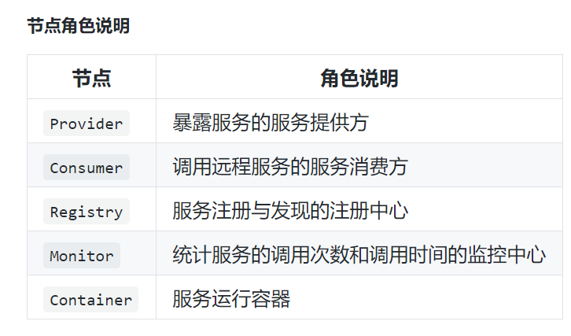
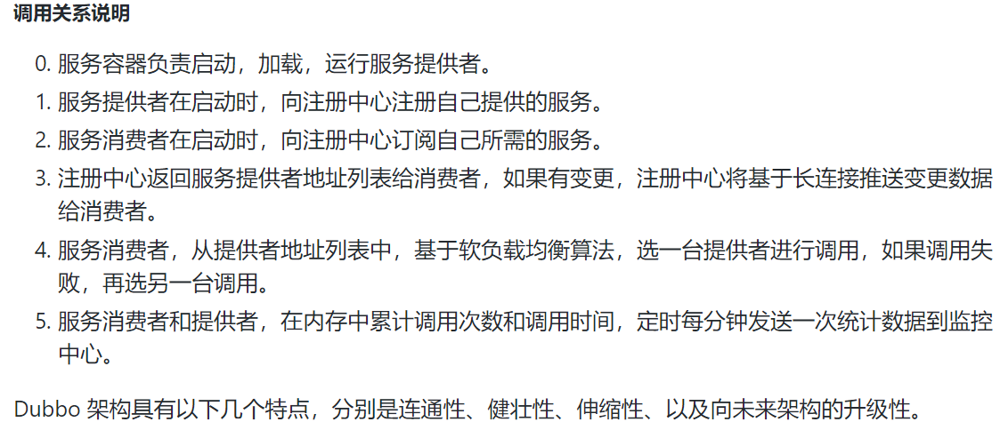

# 一、Dubbo概念

> Dubbo是一个分布式服务框架，致力于提供高性能和透明化的RPC(远程过程调用协议)远程服务调用方案;
>
> 服务间可通过RPC协议进行交互和调用。

- ==微服务==

> 关注于一个大型的应用系统中有多个子功能模块，为降低系统中各子模块间的耦合,将多个子功能模块分离出来，抽象成一个一个微小的服务（具体可表现为IDEA中的一个一个module),服务间可进行交互；

- ==分布式==

> 由于单个计算机的计算性能有限，基于微服务的思想，将一个大型系统拆分成多个微小的服务，将多个服务部署在多个计算机上，从而实现对外(用户)使用该系统仍能感觉是一个完整的系统；对内，系统中的各个子功能模块（服务)部署在不同的计算机上进行计算,服务间相互交互协作组成的一个相对整体。

**细微区别:**微服务的应用系统不一定是分散在多个服务器上，他也可以是同一个服务器；而分布式架构的应用系统，就是分散部署在多个计算机上。

# 二、Dubbo架构

